随着苹果从 X86 转向自家 ARM 芯片并取得成功，高通和微软也开始在 WoA（Windows on ARM）上面发力。
不过微软并不能像苹果一样大刀阔斧迈向 ARM 世界，所以 WoA 亦无法像苹果一样号令全球的软硬件厂商来做 ARM 的原生适配。
那么，在 WoA 世界里，有哪些“坑”在等着我们呢？

即便 WoA 也有着如同苹果 Rosetta 的转译层 Prism/WOW64，但是用户不会只局限于使用应用软件，多多少少会使用一些外设，这就涉及到了更底层的驱动。
这时候转译层是否还有效呢？

春节前，我姐说她的打印机只能打印黑白文件，彩印或者打印照片都无法正常工作。
咨询客服后判断可能是喷头堵住了，可以用电脑做一下深度清洗（打印机内部的功能，但只能通过电脑端控制）。于是让我带着电脑帮她弄一下。
本人的笔记本还是服役接近十年的“傻大黑粗”，自然是不愿做一次“负重”拉练的。

得益于高通的 XBL（eXtenable Bootloader，高通平台的 UEFI 方案），让很大一部分搭载高通芯片的 Android 手机有机会运行 WoA。
如果我们能拿到一台搭载高通芯片的手机的刷机包，便可以很方便的得到 XBL。

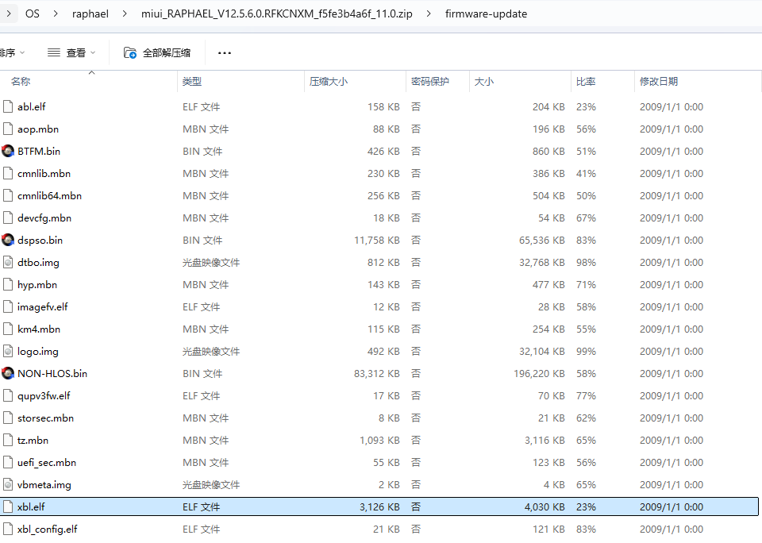

简单看一下 xbl.elf 这个文件，他其实就是一个 UEFI image。

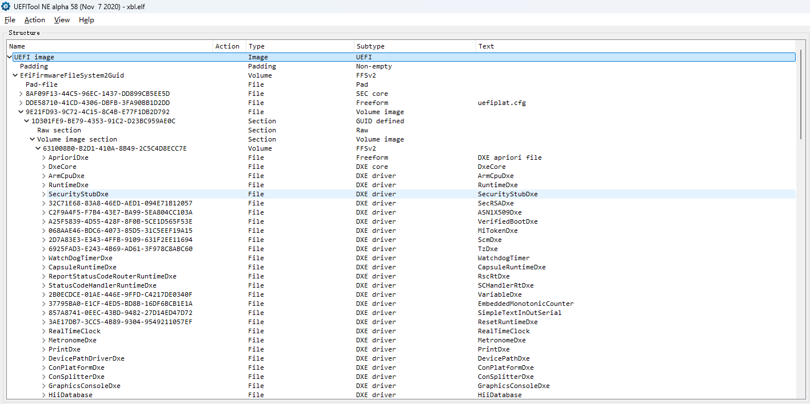

有了 XBL 再加上开源的 UEFI 实现 edk2，最终可以得到这样一台“掌上电脑”。

> 这里只是简单提一下，实际让它能够“跑起来”，不止是简单的 1+1。其中还有很多驱动以及 ACPI 等方面的问题需要额外处理。

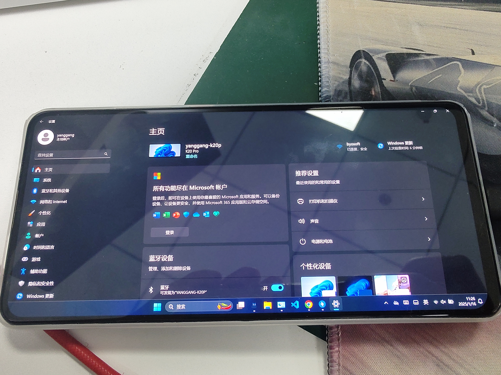

于是我在 Epson 官网找到[打印机的驱动](https://www.epson.com.cn/services/supportproduct.html?p=22a5ff0968674503b63b4698479d221b&tab=1)，由于当时并没有在打印机旁，
所以只是简单地把这个 64 位的驱动安装了一下，看到提示成功的信息便以为“万事俱备，只欠东风”了。

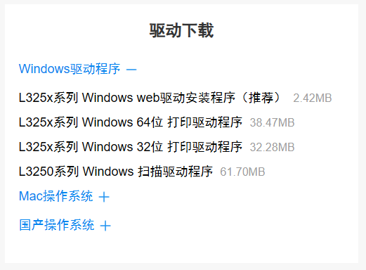

直接胸有成竹的说，我带着这个“手机”就行。本以为能不费吹灰之力把问题解决。结果没料到，驱动这个“坑”便把我绊倒了。

回到家后，拿出这台“掌上电脑”，连接上打印机，保险起见我特意又打印了一份测试文件，来确保真的还有问题。一切都很顺利，正常连接，正常打印，也确实只有黑白内容。

接着便按照客服给的步骤去做深度清洗。结果打开打印机的首选项时却发现，这里只有简单的布局和纸张设置，并没有一个“维护”的菜单。

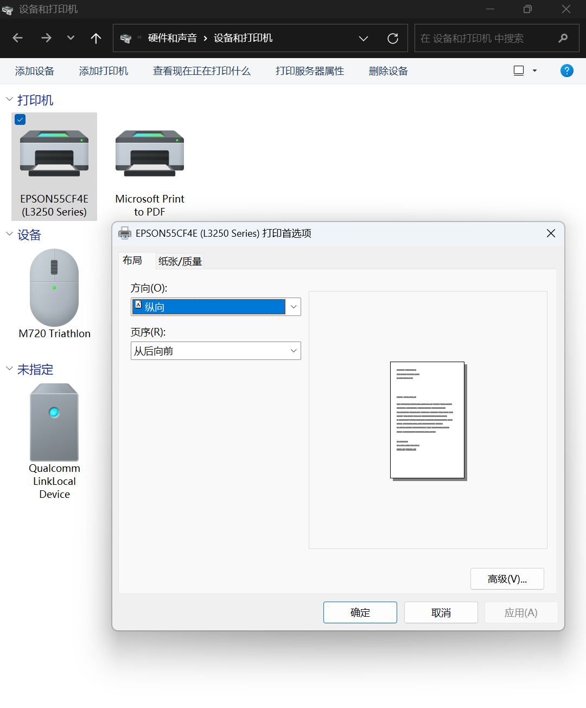

然后我打开打印机的属性看了一下，在高级菜单里面看到“驱动程序”一栏写着 Microsoft IPP Class Driver。
很显然，这应该是微软的一个通用打印机驱动程序。能实现的必然也只是一些简单的通用功能。

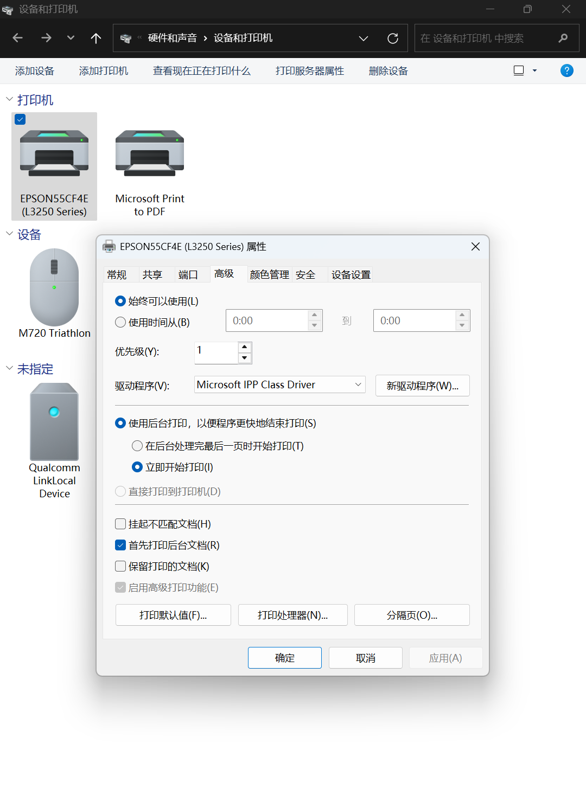

于是，根据客服的建议，再次下载了另一个 Windows web 驱动安装程序，按部就班的选择必要的选项、点击下一步。
安装过程中（此时驱动可能已经安装完毕了）有一步提示要连接打印机，设备扫描到，
点击连接却弹出了一个错误框，告知无法连接（这个安装程序可能并不像 Windows 一样会使用内置的通用驱动连接打印机，而是必须使用厂商自己的驱动）。

到了这一步，基本可以宣告我的这次“赤壁之战”失败了。

但是，为什么呢？于是 Google 一下，发现了这样一个 FAQ：[有关 Arm 上的 Windows 的常见问题](https://learn.microsoft.com/zh-cn/windows/arm/faq)。这里明确地写着如下内容：

> 在所有情况下，内核模式驱动程序和用户模式打印驱动程序必须构建为本机 Arm64 二进制文件才能在 Arm64 设备上工作。 此外，不能执行 x86 或 x64 安装程序在 Arm64 设备上安装 Arm64 驱动程序。

原来仿真/转译并不能支持驱动程序，如果想要使用一些打印机厂商内置的功能，而厂商又没有提供他们构建的 ARM 驱动程序。可能就要另寻他法了。

于是，只好临时借来一台 X86 笔记本，安装驱动、连接打印机。最终可以看到属性里驱动程序处显示的则是正常的厂商驱动。

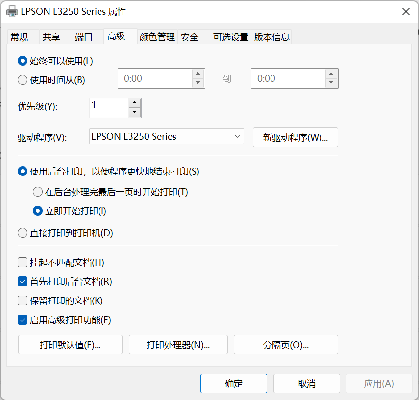

打印机首选项中也展示了厂商驱动所提供的功能。

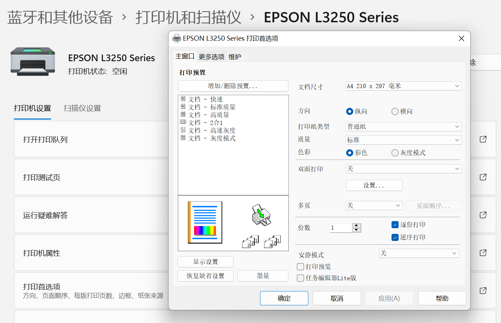

最后在维护菜单里找到深度清洗，然后按照提示完成深度清洗。

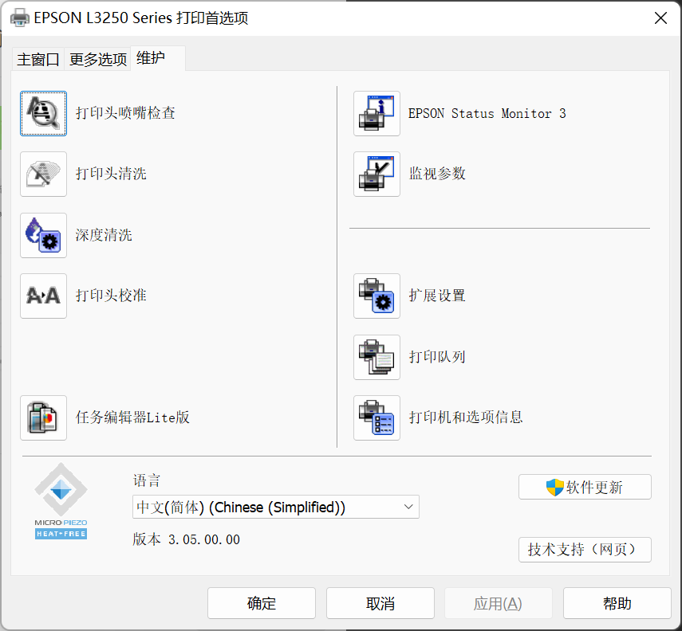

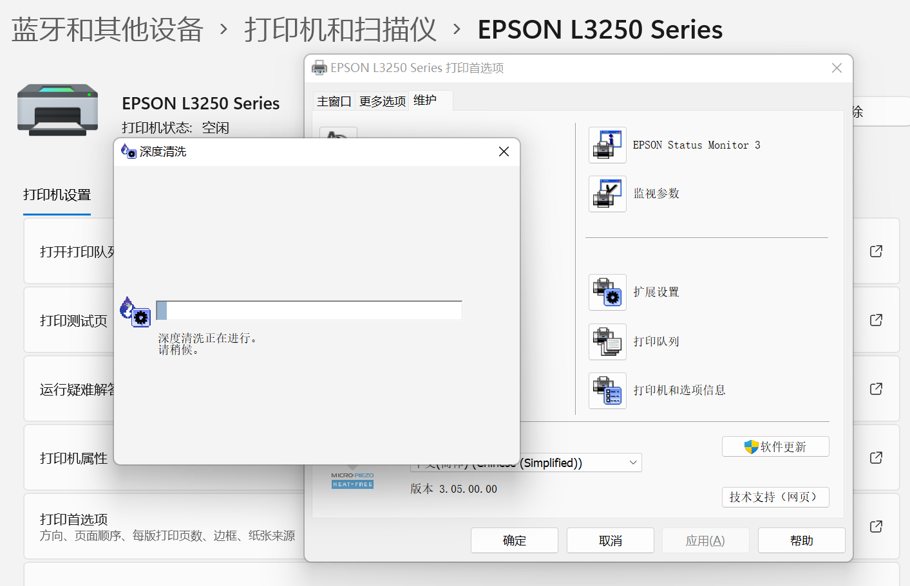

清洗完成后随便找了张纸测试下，果然是可以正常彩印了。

最后，不知道有没有细心的朋友发现，厂商提供的驱动下载界面还有一个国产操作系统分类。
展开之后可以看到其中包含了 UOS && Kylin 的 AMD(X86)/ARM/MIPS 各类架构 CPU 的驱动程序。

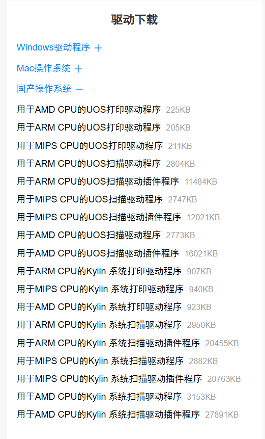

如同其他国内即时通讯软件一般，为了能够保有国产 PC 替换后的市场，打印机厂商肯定会更先在这一块发力。
虽然还没有实际体验过这些驱动的功能是否完整，但对比 WoA 来说，这些国产 ARM 系统至少已经有了原生驱动程序。

如果只是日常轻办公或影音娱乐，似乎无需给 WoA 太多要求，毕竟使用设备厂商的打印机驱动只是一个特例，
Windows 的通用驱动以及对于应用软件的转译层已经足以应对日常使用。
但是你永远无法限定用户的使用场景，那些未曾走过的路上是否还有其他的“坑”呢？
