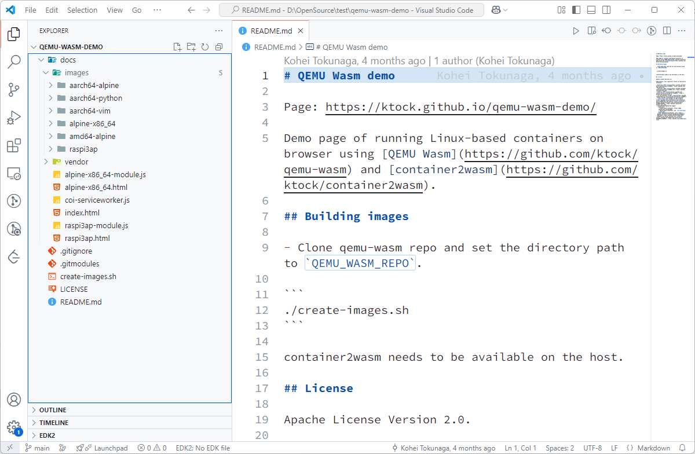
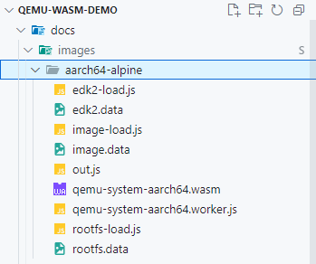
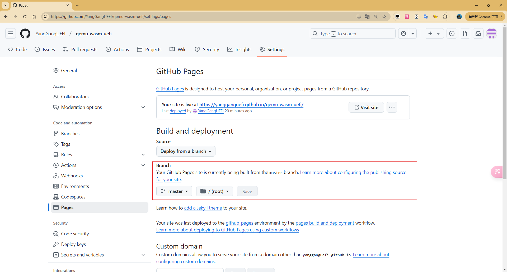
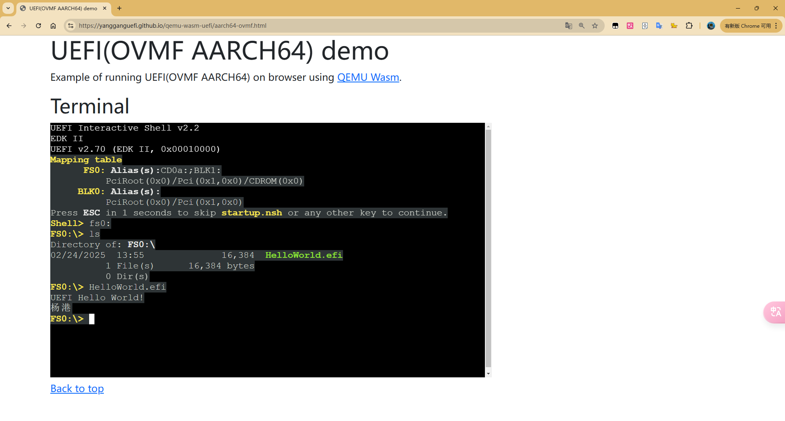
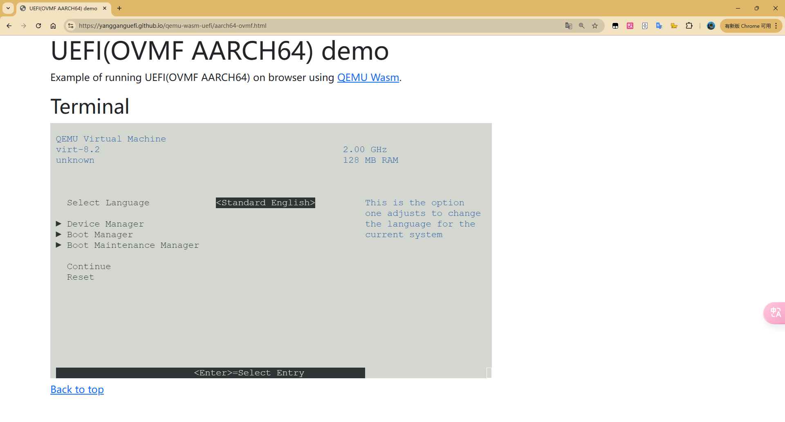
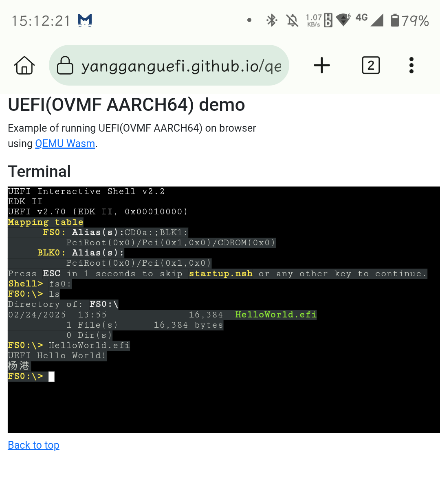

UEFIer 除了乐于移植各种有趣的东西到 UEFI 环境下，应该也总想着让 UEFI 跑在各式各样的硬件/环境中。而 Web Developer 似乎也总期望能让更多的软件在浏览器里运行。如果 UEFI 和 Web 发生碰撞，那么他们俩会擦出怎样的火花呢？

自 [WebAssembly](https://webassembly.org/)（Wasm）问世并被认证为 Web 的标准之一以来，浏览器中能做的事情似乎变得更五花八门了。如果只是想要在浏览器中跑一个 Linux（甚至是 Windows 2000），那么可以直接选择 [Fabrice Bellard](https://bellard.org/) 大佬（也是 QEMU 的作者）的 [JSLinux](https://bellard.org/jslinux/) 体验一番。但是如果我只想要一个 UEFI 的环境要怎么办呢？

熟悉 [EDK2](https://github.com/tianocore/edk2) 的朋友必然也会对 [QEMU](https://www.qemu.org/) 有一定的了解。通常我们会使用 QEMU 加载一个 OVMF.fd 来启动到 UEFI 环境，并做一些临时的验证工作。那么，如果可以在浏览器中运行 QEMU，再给它提供一个 OVMF.fd，Web 中的 UEFI 环境不就有了吗？

不过 QEMU 官方只提供了 Source code 以及 Linux、macOS、Windows 的安装方法，Web 上要怎么运行呢？由于 QEMU 是 C/C++ 编写的，而借助 [emscripten](https://emscripten.org/) 可以将 C/C++ 代码移植到 Web 平台（Wasm）。所以，有了 Source code 似乎就有机会在浏览器里跑 QEMU 了。

通常我能想到的点子，大概也早有人已经想到并实践过了。所以有些轮子也就没有必要重复去造了（也节省了部分脑细胞）。

GitHub 一下，可以发现确实有 [Qemu.js](https://github.com/atrosinenko/qemujs) 和 [qemu-wasm](https://github.com/ktock/qemu-wasm) 这样两个项目，二者类似，都是将 QEMU 移植到 Web 平台，同时也都提供了可以直接体验的 Demo（[qemujs-demo](https://atrosinenko.github.io/qemujs-demo/) 和 [qemu-wasm-demo](https://ktock.github.io/qemu-wasm-demo/)）。不过 qemujs 最后更新的时间已在 6 年前，并且只提供了 x86 及 mips 的 demo。而 qemu-wasm 是最近开始并在更新着的项目，同时也提供了更多的 demo（x86_64、AArch64 等）。

这些 Demo 都是托管在 GitHub Pages 上的，所以我们可以方便的拿到网站的源码。



大致看一下代码，可以发现和 Demo 网站一样，实际能直接跑起来的只有 `alpine-x86_64.html` 和 `raspi3ap.html`。但是 `images` 里还有很多其他环境所需的文件。这里我们选择以 `aarch64-alpine` 下的 `out.js` `qemu-system-aarch64.wasm` 和 `qemu-system-aarch64.worker.js` 为基础来搭建一个跑在浏览器里的 AARCH64 的 UEFI 环境，并且在其中运行一个 HelloWorld.efi APP。为什么选择 AARCH64 而不是 x86_64/amd64 呢？这个后面再细说，我们先看看 Web 上的 AARCH64 UEFI 环境具体要怎么弄。



首先，我们另外新建一个文件夹 `qemu-wasm-uefi`，然后从 `qemu-wasm-demo` 中拷贝一些必要的文件。

> aarch64-ovmf.html aarch64-ovmf.js 来自 alpine-x86_64.html alpine-x86_64-module.js

接着创建 `load-uefi` 及 `load-cdrom` 相关文件，前者提供了 QEMU 运行所必须的固件，后者则是一个包含 fat 分区的 iso 镜像（其中有我们最后要测试的 HelloWorld.efi）。

```
./pack-uefi/
├── QEMU_EFI.fd
├── efi-virtio.rom
├── kvmvapic.bin
└── vgabios-stdvga.bin

QEMU_UEFI.fd 为本地构建的 ArmVirtQemu-AARCH64 固件
其余来自 qemu 安装目录（有些是调试 x86_64 时添加进来的，这里可能并不一定需要）
```

```
./pack-cdrom/
└── test.iso
```

这两个文件夹都放在 [emscripten](https://github.com/emscripten-core/emscripten) 代码根目录下，然后执行如下命令：

```
.\tools\file_packager.bat load-uefi.data --preload .\pack-uefi > load-uefi.js
.\tools\file_packager.bat load-cdrom.data --preload .\pack-cdrom > load-cdrom.js
```

最后将生成的 `load-cdrom.data` `load-cdrom.js` `load-uefi.data` `load-uefi.js` 都拷贝到 `qemu-wasm-uefi` 下适当的位置，最终的 tree 如下：

```
./qemu-wasm-uefi
├── aarch64-ovmf.html
├── aarch64-ovmf.js
├── coi-serviceworker.js
├── images
│   └── aarch64-ovmf
│       ├── load-cdrom.data
│       ├── load-cdrom.js
│       ├── load-uefi.data
│       ├── load-uefi.js
│       ├── out.js
│       ├── qemu-system-aarch64.wasm
│       └── qemu-system-aarch64.worker.js
└── index.html
```

`aarch64-ovmf.html` `aarch64-ovmf.js` 是我们需要修改的关键文件，主要是 QEMU 的启动参数以及 js 的路径。代码可以在 [qemu-wasm-uefi](https://github.com/YangGangUEFI/qemu-wasm-uefi) 找到，也很简单，这里就不再赘述了。

修改完成之后，还需要测试一下。因为最终托管在 GitHub Pages 时会以仓库名（这里我使用的是 `qemu-wasm-uefi`）作为子目录以区分不同的 Pages，本地测试时可以在 `qemu-wasm-uefi` 上级目录下起一个临时的 http server，然后在浏览器中打开 [http://localhost/qemu-wasm-uefi/](http://localhost/qemu-wasm-uefi/) 即可。

本地测试成功后，便可以将全部代码及文件 push 到 GitHub 仓库，然后在仓库的 Settings/Pages 下将仓库主分支的根目录设为站点根目录。



等待 GitHub 自动部署完成后，[https://yangganguefi.github.io/qemu-wasm-uefi/](https://yangganguefi.github.io/qemu-wasm-uefi/) 便可正常访问了，点击 `AARCH64 UEFI OVMF(ArmVirtQemu-AARCH64)` 后面的 `start`，等待片刻后便可以自动启动到 EDK II 的 UEFI Shell。然后测试下前面放进去的 HelloWorld.efi，结果如下：



Shell 下输入 Exit 然后回车，便可以进到 EDK II 的 SETUP 界面（UiApp）。



我们甚至可以打开手机的浏览器试一下，也是可以运行的：



都看到这了，你还不打开 [https://yangganguefi.github.io/qemu-wasm-uefi/](https://yangganguefi.github.io/qemu-wasm-uefi/) 试一下吗？（注意流量）

最后，说一说为什么选择 AARCH64 而不是 x86_64/amd64。因为测试时发现，启动到 Shell 后，再做其他操作后输出便乱码了。起初以为是 xterm/xterm-pty 配置的问题，本地调试一番，还去找 [@ktock](https://github.com/ktock) 咨询了下，依然没法解决。最后想起来换到 AARCH64 试了下，一切正常（应该也就排除了 xterm/xterm-pty 的问题）。

起初也只是想先跑起来一个能用的 UEFI 环境，没刻意想要什么特定架构，所以 x86_64/amd64 就留到后面 TODO 了。（可能要手动编译下 qemu-wasm 来调试了？有什么建议也请评论告诉我）

最后的最后，现在跑起来的只是一个字符界面的环境，没有 Graphic Output，同时文件系统也不够灵活，所以也就没法更方便的演示更多东西。但是像 [qemujs-demo](https://atrosinenko.github.io/qemujs-demo/) 和 [JSLinux](https://bellard.org/jslinux/) 其实都有提供具备图形输出的 demo，所以理论上还有很多事情可以继续优化的。

另外，[edk2](https://github.com/tianocore/edk2) 也是 C 语言的项目，也有不基于 QEMU 的模拟环境 `EmulatorPkg`，那么 Web 下的 UEFI 是否还有更多可能呢？
