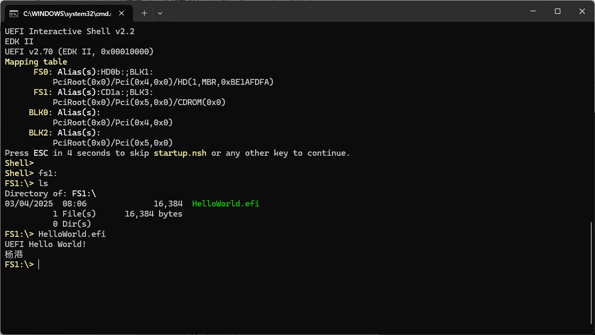

上一篇文章 [浏览器中的 UEFI 体验 -- QEMU Wasm](https://yangganguefi.github.io/posts/qemu-wasm-uefi/) 有提到我们在测试 QEMU UEFI 环境时使用了一个 test.iso，那么如何来制作这样一个 iso 镜像呢？

### 0x00 准备工作

1. 工具安装：
   
   * Linux系统：安装 `dosfstools`（用于创建 FAT 文件系统）和 `genisoimage`（用于生成 ISO）。

      ```
      sudo apt-get install dosfstools genisoimage
      ```
   * Windows系统：准备 UltraISO（用于编辑镜像文件）。

2. 文件准备：

   * 需包含的 UEFI 程序（如 HelloWorld.efi）。

### 0x01 创建 FAT 镜像文件

```
mkfs.vfat -C fat-32M.bin 0x8000
```

### 0x02 添加文件到镜像

#### 方法 1：Linux 命令行
1. 挂载镜像：

   ```
   sudo mount -o loop fat-32M.bin /mnt
   ```

2. 复制文件：

   ```
   sudo cp HelloWorld.efi /mnt/
   ```

3. 卸载镜像：

   ```
   sudo umount /mnt
   ```

#### 方法 2：使用 UltraISO（Windows）

1. 打开 UltraISO，选择 文件 > 打开，加载 fat-32M.bin。

2. 将 HelloWorld.efi 拖入右侧窗口。

3. 保存修改（文件 > 保存）。

### 0x03 生成可启动 ISO

1. 创建ISO目录结构：

   ```
   mkdir iso_root
   mv fat-32M.bin iso_root/
   ```

2. 生成ISO镜像：

   ```
   cd iso_root/
   genisoimage -e fat-32M.bin -b fat-32M.bin -no-emul-boot    -output ./test.iso ./
   ```

### 0x04 验证与使用
1. 检查ISO结构：

   ```
   isoinfo -i test.iso -l
   ```

   输出结果如下：

   ```
   directory listing of /
   d---------   0    0    0            2048 Mar  4 2025 [     24    02]  . 
   d---------   0    0    0            2048 Mar  4 2025 [     24    02]  .. 
   ----------   0    0    0            2048 Mar  4 2025 [     25    00]  BOOT.CAT;1 
   ----------   0    0    0        33554432 Mar  4 2025 [     26    00]  FAT_32M.BIN;1
   ```

2. 在虚拟机上测试：

   * 使用 QEMU 启动 OVMF：

      ```
      qemu-system-x86_64 -bios ovmf.fd -cdrom test.iso
      # 仅示例，-cdrom test.iso 是我们要测试的 ISO 镜像
      ```

   * 进入 UEFI Shell：

      可以看到 Mapping table 有如下的 FS：

      ```
      FS1: Alias(s):CD1a:;BLK3:
          PciRoot(0x0)/Pci(0x5,0x0)/CDROM(0x0)
      ```

      以此输入如下命令：

      ```
      fs1:
      ls
      HelloWorld.efi
      ```

      可以看到如下测试结果：

      

### 0xFF

通过以上步骤，我们可以获得一个在 UEFI Shell 能直接访问的 FAT 分区光盘镜像。如果我们想在某些受限制的条件来简单测试一些 UEFI 程序，这也许会有一些帮助。
