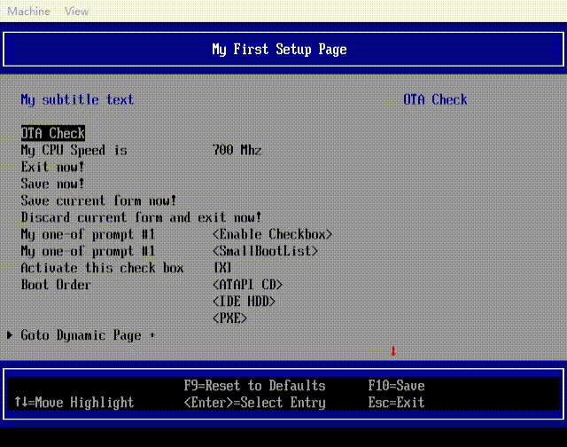
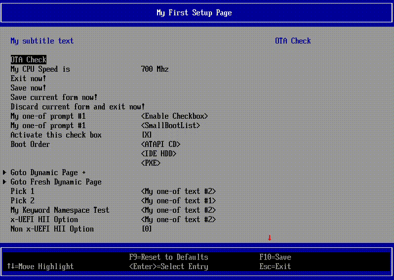
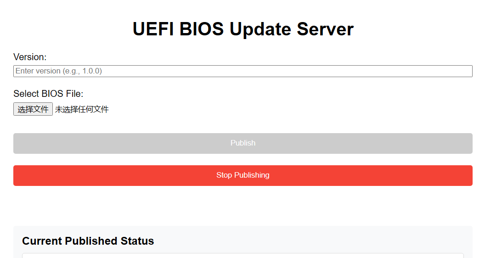

通常我们更新 BIOS 时会在各厂商的支持网站里下载一个当前型号的可执行文件，双击运行后，完成 BIOS 的更新并重启机器。对于个人用户来说，这些步骤看起来稍显繁琐，但实际上已足够便利。

而对于每天都要不厌其烦地更新无数遍 BIOS 的工程师来说，选择可能又多了些。直接读写 Flash 的烧录工具，BIOS 内置的更新工具/接口，亦或是服务器上的 BMC。

但是，烧录工具想要方便使用，需要主板上预留插针，不然频繁抠 BIOS 芯片可能会让人抓狂。内置的更新工具/接口则需要一个存储介质去搬运要更新的 BIOS，来回拔插 U 盘应该算不上优雅。BMC 只需一根网线便能在工作机上更新 BIOS，那它是最优解吗？

先不说根本就没有 BMC 的一众台式机和笔记本，即便是服务器，可能也会出于硬件或 BMC 软件的种种原因，而无法提供一个可供稳定使用的带外更新环境。那么，就没有办法可以减少一些频繁更新 BIOS 的痛苦吗？

### 软件？软件+硬件？

之前在一个服务器项目的初期，因为硬件需要 rework，便导致迟迟无法使用 BMC 更新 BIOS。间接地导致我需要每天在工作机和服务器主板之间扮演一个传输效率很低的“接线员”。

最近又在做一个笔记本项目，根本不会有 BMC 的存在，主板也很小巧，亦不会留有插针，“接线员”的活想停下来似乎有些难度。

但是考虑一下 USB 接口的感受，一个想法还是冒了出来。如果有一个自带 http server 的 U 盘，再借助 BIOS 的内置更新工具/接口，似乎能让 USB 接口少受累一些。

简单检索一番，技术方案似乎也挺简单（ESP32 + TF卡），不过对于原理图还只是停留在简单的看看的我来说，做一个硬件似乎并不是最佳选择。（另外，这个方案也有少数的成品在卖，再额外消费去买一个更是没有必要了。）于是便放弃了这个想法。

那么，剩下的就只有纯软件的方案了。要怎么来做呢？

### 我不想再拔插 U 盘了

我们已经有了内置的更新工具/接口，那么剩下的需求就是将 BIOS 传递给测试机即可。由于都是内网环境，所以一个简单的 http server 便可以实现。

首先可以先使用 `py -m http.server 80` 命令启一个 Python 自带的 http server，然后在测试机的 UEFI Shell 中使用 `http` 命令简单测试一下网络的连接和下载速度。不出意外，测试机器可以正常从工作机的 http server 获取文件。

接下来，只需要写一段代码通过 http 将要更新的 BIOS 下载下来，然后传递给内置的更新工具/接口更新即可。
> 事实上，如果有独立的更新工具 Application，到这里可以直接写一个 shell 脚本即可。
> 但是我没有选择这么做，原因大致有两点：
> 
> 一是 Shell 的 http 命令的性能不够好（之后可能考虑将 edk2 的开源代码优化一下）
> 
> 二是我希望这一套流程不仅可以在 Shell 中使用（但最后还是主要在 Shell 下使用了）

### 少造一些轮子

前面提到了 UEFI Shell 下的 http 命令。这个命令在 edk2 中也已经存在数年，功能也相对比较稳定。即便不直接使用这个命令，但为了不重复造轮子（顺便少消耗点头发），它的代码还是可以参考的。所以，我选择从它（[HttpDynamicCommand](https://github.com/tianocore/edk2/tree/master/ShellPkg/DynamicCommand/HttpDynamicCommand)）动手，改造出一个 [HttpDownloadLib](https://github.com/YangGangUEFI/UefiOta/tree/master/Library/HttpDownloadLib)。

那么，先来看一下 http 命令的主要帮助信息：

```
Shell> http -?
Download a file from HTTP server.

HTTP [-i interface] [-l port] [-t timeout] [-s size] [-m] [-k]
      <URL> [localfilepath]

  -i interface     - Specifies an adapter name, i.e., eth0.
  -k                 Keep the downloaded file even if there was an error.
                     If this parameter is not used, the file will be deleted.
  -l port          - Specifies the local port number. Default value is 0
                     and the port number is automatically assigned.
  -m                 Measure and report download time (in seconds).
  -s size            The size of the download buffer for a chunk, in bytes.
                     Default is 32K. Note that larger buffer does not imply
                     better speed.
  -t timeout       - The number of seconds to wait for completion of
                     requests and responses. Default is 0 which is 'automatic'.
  URL
  Two types of providing of URLs are supported:
    1. tftp-like, where host and http_uri are separate parameters
       (example: host /host_uri), and
    2. wget-like, where host and host_uri is one parameter.
       (example: host/host_uri)

    http_uri         - HTTP server URI to download the file.

  localfilepath    - Local destination file path.
```

以及一个基本的使用效果：

```
FS0:\> http http://192.168.10.23:5000/BIN/BIOS.bin -m
[=======================================>]   32768 Kb, 44s
FS0:\>
```

其中主要的参数是 `<URI>` ，即要下载的文件链接；另一个是下载的进度条，这会明显提升用户的使用体验。

以此为基础，主要要做的就两件事了：一是将必要的命令行参数转换为函数参数；二是提供一个 Callback 以按照调用方提供的方式展示进度条。

最终（仍然很基础，未包含更多的参数），这个 API 长这样：

```
EFI_STATUS
EFIAPI
HttpDownloadFile (
  IN     CHAR16                           *Url,
  IN OUT UINTN                            *BufferSize,
  IN     VOID                             *Buffer          OPTIONAL,
  IN     HTTP_DOWNLOAD_PROGRESS_CALLBACK  ProgressCallback OPTIONAL
  );
```

接下来就是按照预期的 API 改造原本的 `Http.c` 以及 `RunHttp()` 的参数。主要是移除一些 Shell 命令行需要而 Library 中不需要的显示内容、调用 Callback 显示进度条，扩展 `RunHttp()` 的参数等。

主要工作其实是删减，便不再赘述，感兴趣的可以到 https://github.com/YangGangUEFI/UefiOta 这里查看 `Library/HttpDownloadLib` 下的代码。（也可以与原始的命令行 http 对比查看，更方便看到改动点）

### 改造完成，测试一下

最初的想法是在 BIOS SETUP 中做一个选项，选择它来自动获取 BIOS 并更新，所以我先在 OVMF 中加了一个选项：

```
    text
      help   = STRING_TOKEN(STR_UEFI_OTA),
      text   = STRING_TOKEN(STR_UEFI_OTA),
      flags  = INTERACTIVE,
      key    = 0x1024;
```

以及选项对应的 Callback 函数。
> `BiosUpdateCheckHttp()` 会调用改造后的 API `HttpDownloadFile()` 下载一个 BIOS.bin 文件：

```
...
EFI_STATUS
EFIAPI
DriverCallback (
...
      switch (QuestionId) {
        case 0x1024:
          BiosUpdateCheckHttp();
          break;
...
```

然后在 qemu 中测试是否能按预期下载文件。

最终的效果如下（这个代码是没有优化过的，所以可以看到下载速度还是挺慢的）：



测试通过，但是很明显，这个下载速度不够好。问题出在哪里呢？有没有可以优化的地方？

### 一个“尚且够用”的优化

通过查看原始的 [Http.c](https://github.com/tianocore/edk2/blob/master/ShellPkg/DynamicCommand/HttpDynamicCommand/Http.c)，可以发现他是直接使用 `HttpMethodGet` 分段下载一段内容然后写一段内容到本地文件（重复的文件操作），这个操作似乎对性能不够友好，即便在改造时已经改为使用内存（还是要重复 `ReallocatePool`），效果依然很差。

既然这里的“重复”操作对性能不友好，那就改掉它。本着不重复造轮子的理念，当然是先去看一看另一个使用更广泛的 [HttpBootDxe](https://github.com/tianocore/edk2/tree/master/NetworkPkg/HttpBootDxe)（HTTP Boot 所使用的模块）。

查看 `HttpBootDxe` 以及 HTTP Boot 的相关逻辑，可以发现它会使用 `HttpMethodHead` 获取完整的 `ContentLength`，然后一次性申请完整的内存供后续的 `HttpMethodGet` 使用。

参考这份逻辑，如法炮制。优化之后再测试一下：



可以看到，下载速度比之前还是快了不少的。

> 另外，根据实际使用的场景，后面又添加了一些 DHCP 的检查/设置步骤，尽量减少一些额外的操作。

接下来便可以在真实环境中做一下测试了。

### 真实环境中的测试

最初是像在 OVMF 中一样，添加了一个选项，点击它先下载文件然后传递给更新接口。但是这样导致我要修改每个项目的代码去集成上面的内容（并且改动也只能一直在本地放着，很不方便），所以最终还是单独写了一个 Shell Application，通过执行它，来完成下载、更新等一系列操作。

下面是这个“不怎么完善”的 App 的演示：


整体用下来还是能够省一些力气的，至少 USB 接口会感谢我一下吧？

### 改进（咕咕咕）

1. `HttpDownloadFile()` 的参数要扩展一下
2. DHCP 相关还要优化一下
3. 演示的这个 App 有些粗糙（整个“炫酷”的 UI？）

### 等等，还有 HTTP Server

如果每次都要使用 `py -m http.server 80` 开启服务，似乎也不太优雅。所以找 Claude 帮忙写了一个小脚本 [UEFIUpdateServer.py](https://github.com/YangGangUEFI/UefiOta/blob/master/ServerScript/UEFIUpdateServer.py)。

使用 `py -3 UEFIUpdateServer.py {port}` 命令，可以启动一个 http server 并提供一个 web 页面：



之后便可以在网页上选择要更新的 BIOS 以及可以写一些简要的更新说明，点击 Publish 之后 `http://123.456.78.90:5000/update` 便会将更新说明以及文件下载链接按如下格式提供出来：

```
{"message": "New BIOS version available: 01.01", "image_url": "http://123.456.78.90:5000/BIN/BIOS.bin"}
```

上面测试的 App 便是解析这些内容，得到链接后再下载并使用的。

### 最后

以上提到的代码，除了最后测试的 App，均可在 https://github.com/YangGangUEFI/UefiOta 中找到。

如果你发现什么问题，或者有优化的建议，也请告诉我。
