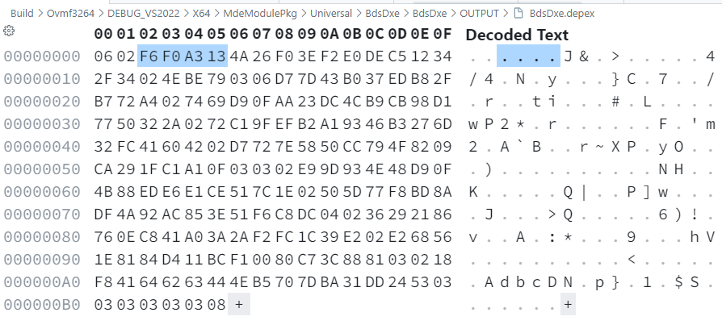
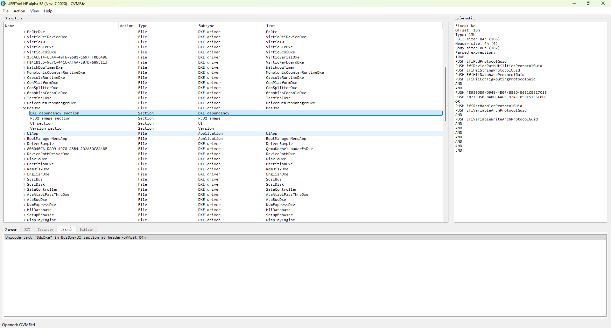
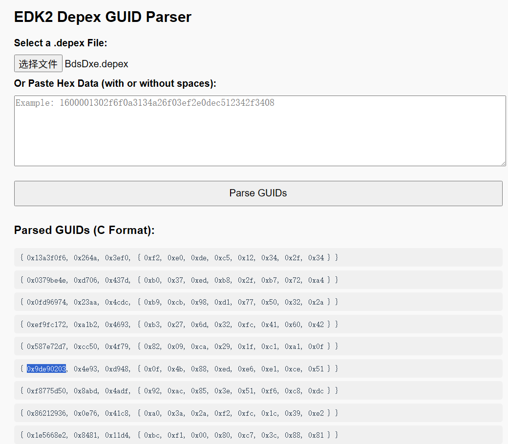
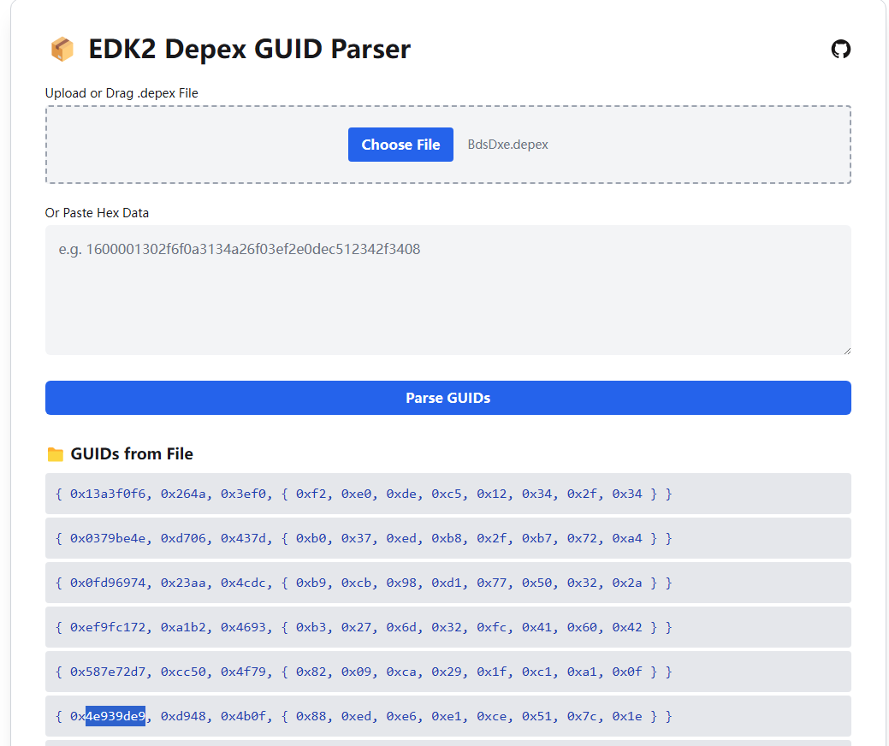
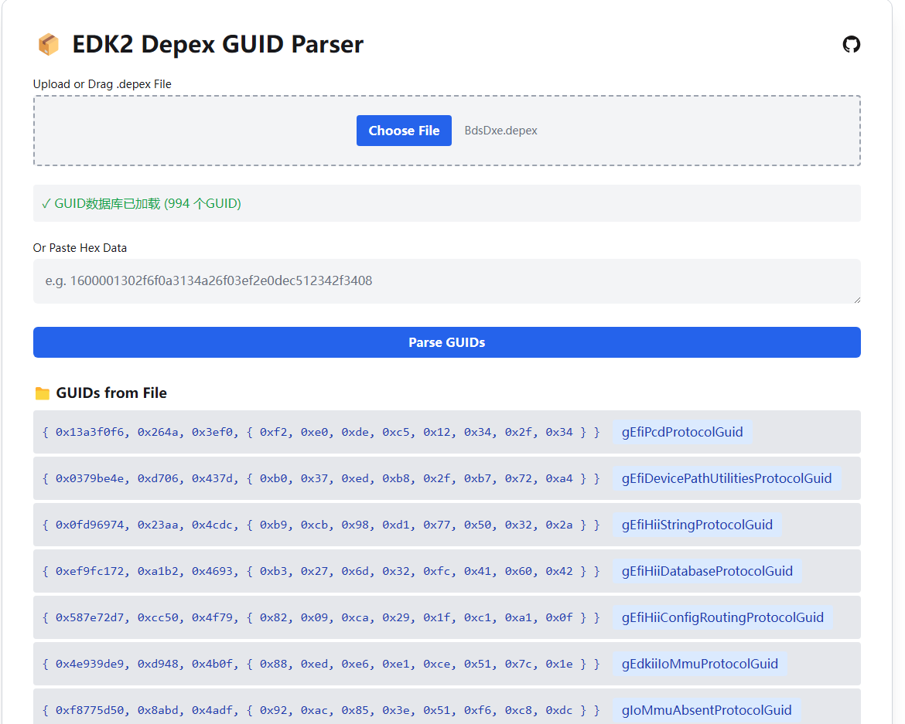
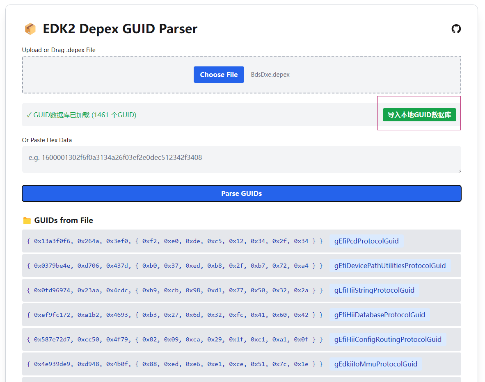

在日常 BIOS 开发的过程中，有时出于代码管控的目的，会使用一些二进制模块。这些二进制模块可能包含 .depex 文件，如果我们想确认这个模块的依赖关系，就需要从 .depex 中找出其依赖的 GUID。然而，手动查看这些二进制数据往往比较繁琐，如果有合适的方式能自动提取出其中包含的 GUID，那样就会方便很多。

### 当前的方法

如果比较熟悉 edk2 DEPEX 的结构，对于二进制数量较少的文件，我们可以直接找出 GUID 的前 4-byte 值，然后在代码（.dec 文件）中搜索。但是后面如果还有一堆数据，这样做实在是太费眼。



如果这个二进制模块已经包含在了 BIOS bin 文件中，那么可以使用 [UEFITool](https://github.com/LongSoft/UEFITool) 打开 BIOS 文件，然后搜索对应的模块名称，然后再点击这个模块的 dependency section，便可以在右边的 Information 中看到依赖的 GUID。如下是 OVMF 的 BdsDxe 的信息：（只是示例，对于源码模块，我们可以更方便的使用 edk2 build 的 -y 命令生成 report 文件来查看其依赖）



工具的效果很好，依赖关系也一目了然，但是前提是对应的二进制模块要在 BIOS bin 中，还要一步步找到对应 section，并且一个单独的 .depex 文件也没法查看。

### EDK2 Depex GUID Parser

基于以上的优缺点，一个即开即用，只服务于解析 depex 的应用软件似乎能在特定时刻解决一些问题。那么怎么快速来做这样一个软件呢？

LLM 当下正火热，根据个人日常简单使用过的几家产品的效果看，前端/Python 实际做出来的东西效果还可以。同时，像 GitHub、Cloudflare 等服务商都提供了免费的 Pages 服务，让我们可以托管一些网页在上面。所以最终的选择就显而易见了。

描述完要做的事以及一些基本的概念及效果，最终我们得到了一份代码（我让它把代码都放在了一个单独的 html 中）。



直接本地浏览器打开测试一下，可以获取到 GUID 数据，大体逻辑应该没有太大问题，于是继续发出“需求”，让它重构下前端，让页面看起来更“现代化”一些。

在 LLM 继续开发的过程刚好来继续测试更多的例子。简单的数据都可以正常提取出 GUID，但是从上图使用 OVMF 的 BdsDxe.depex 测试的结果可以发现，它对 depex 的结构了解的似乎并不透彻（我最初也没有提供非常详细的提示词）。导致部分 GUID 是错误的。

`0x9de90203` 中的 `03` `02` 对应的应该是 `DEPEX_OPCODE_AND` 和 `DEPEX_OPCODE_PUSH` 而非 GUID 数据。DEPEX 的结构我们是知道的，这部分代码逻辑也就不难改了，直接上手[修复](https://github.com/YangGangUEFI/Edk2DepexGUIDParser/commit/81f8e0882084af1f96bd68dff410665ce1a41d74)了。

再来测试下，现在结果就正确了。


### 内容更丰富一些（GUIDName）

根据前面爬取的 GUID，我们去代码中搜索一下，就可以找到对应的 GUID。但是如果能够在爬取后直接显示其对应的 GUID Name 就更好了。

有了需求，我们便可以继续给 LLM AI 发任务了，前面也提到了 LLM 在 Python 上面效果也不错，这次我们就让它帮我们爬取 edk2 代码的所有 .dec 文件并提取其中的 GUID 及对应的 Name，并保存到 json 文件中。

这次代码生成的效果很好，没有额外的修改，甚至我都没有看一眼这个脚本的具体内容。（这个脚本可以在 [https://github.com/YangGangUEFI/DecGuidParser](https://github.com/YangGangUEFI/DecGuidParser) 获取到）

```
D:\OpenSource\edk2>py -3 DecGuidParser.py ./ -o Edk2Guid.json
处理文件: ArmPkg\ArmPkg.dec
处理文件: ArmPlatformPkg\ArmPlatformPkg.dec
处理文件: ArmVirtPkg\ArmVirtPkg.dec
处理文件: CryptoPkg\CryptoPkg.dec
处理文件: DynamicTablesPkg\DynamicTablesPkg.dec
处理文件: EmbeddedPkg\EmbeddedPkg.dec
处理文件: EmulatorPkg\EmulatorPkg.dec
处理文件: FatPkg\FatPkg.dec
处理文件: FmpDevicePkg\FmpDevicePkg.dec
处理文件: IntelFsp2Pkg\IntelFsp2Pkg.dec
处理文件: IntelFsp2WrapperPkg\IntelFsp2WrapperPkg.dec
处理文件: LvglPkg\LvglPkg.dec
处理文件: MdeModulePkg\MdeModulePkg.dec
处理文件: MdePkg\MdePkg.dec
处理文件: NetworkPkg\NetworkPkg.dec
处理文件: OvmfPkg\OvmfPkg.dec
处理文件: PcAtChipsetPkg\PcAtChipsetPkg.dec
处理文件: PrmPkg\PrmPkg.dec
处理文件: RedfishPkg\RedfishPkg.dec
处理文件: SecurityPkg\SecurityPkg.dec
处理文件: ShellPkg\ShellPkg.dec
处理文件: SignedCapsulePkg\SignedCapsulePkg.dec
处理文件: SourceLevelDebugPkg\SourceLevelDebugPkg.dec
处理文件: StandaloneMmPkg\StandaloneMmPkg.dec
处理文件: UefiCpuPkg\UefiCpuPkg.dec
处理文件: UefiOta\UefiOta.dec
处理文件: UefiPayloadPkg\UefiPayloadPkg.dec
处理文件: UnitTestFrameworkPkg\UnitTestFrameworkPkg.dec
已将994个GUID保存到 Edk2Guid.json
共提取了 994 个唯一GUID定义
```

执行完命令，我们就得到了 `Edk2Guid.json` 这样一个文件。

接下来我们要做的就是在获取到 GUIDValue 后再加一步操作来获取对应的 GUIDName，继续给 LLM 发任务！最终的效果如下：



可以看到，现在可以直接显示出 GUID 对应的 `gEfiPcdProtocolGuid` 名称了。

另外，由于当前使用的 `Edk2Guid.json` 仅包含开源代码的相关信息，所以又添加了一个导入本地 `GUID.json` 的功能，需要的时候可以使用 [DecGuidParser.py](https://github.com/YangGangUEFI/DecGuidParser) 脚本生成后导入。



### 0xFF

代码完成后，接下来就是上传到 GitHub，然后在仓库设置中启用 Pages 并设置为从仓库的 root 目录部署，最终我们就得到了 [https://yangganguefi.github.io/Edk2DepexGUIDParser/](https://yangganguefi.github.io/Edk2DepexGUIDParser/) 这样一个网页。

看到这里，不妨点开网页试一下喽。如果有问题，请告诉我，我会帮你转达给 LLM 的。:)
