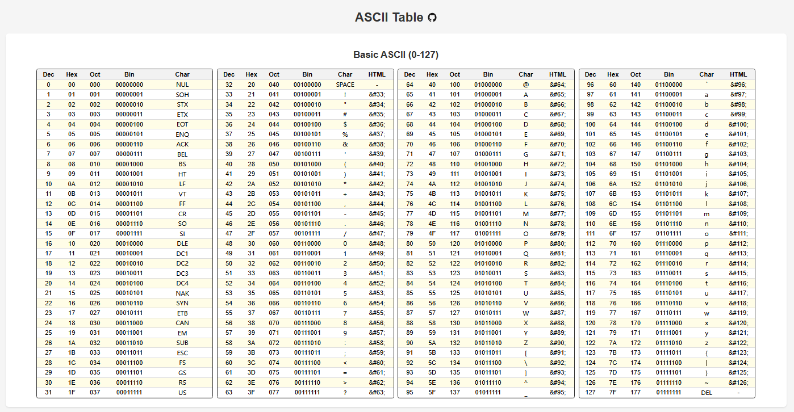
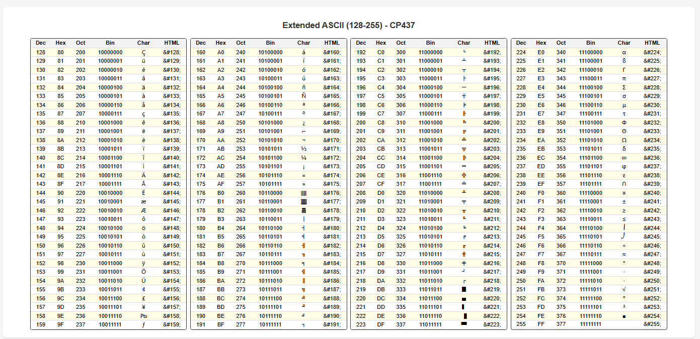

在日常工作中难免会接触到 ASCII 码。但是最近发现之前一直用来随手查 ASCII 码的一个网站加入了广告。
网站虽然很朴素，但临时看一眼也够用了。不过加上了大篇幅的广告，就很影响体验了。

好在当下 LLM AI 发展迅速，在空闲的时候便让 AI 帮忙搓一个网页，然后部署到了 Github Pages 上。

链接如下：

[https://yangganguefi.github.io/tools/AsciiTable/](https://yangganguefi.github.io/tools/AsciiTable/)

打开之后便是完整的 ASCII 码列表，其中列出了十进制、十六进制、八进制、对应的字符或控制符以及 HTML CODE。

另外还有 CP437 的扩展 ASCII 码。

这样，就拥有了一个自己的 ASCII 码查询网页，再也不用担心它出现广告，影响我们的使用体验了。

最后，谈一谈最近的 LLM AI 使用体验。

虽然最近 Google “发善心”让不少人免费用上了 Gemini Advanced，但是根据个人日常的使用体验，Claude 在编码方面还是要更胜一筹。
虽然它的网页 Free 版的限制挺多（动不动就被限制使用，以及对 IP 也更严格），但就在有限的 Token 下，通过完善的 Prompt 也能完成很多不错的任务。
点名表扬一下。:)
