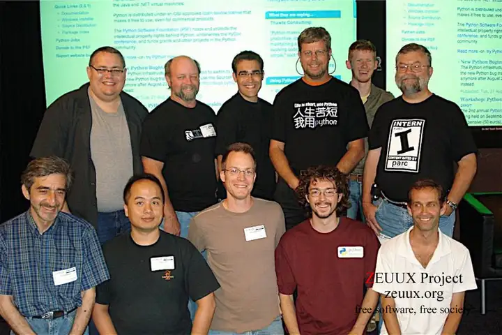
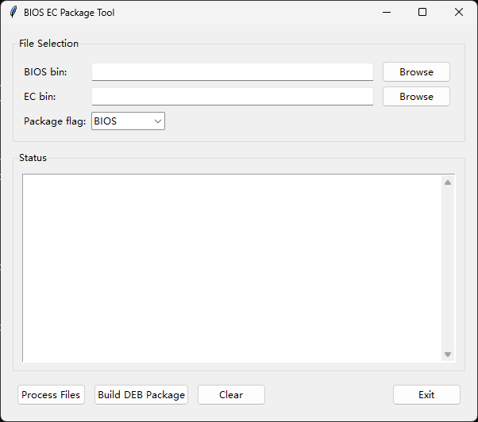

接触过 Python 的朋友大概也都听过一句话：“人生苦短，我用 Python”。



但是在 LLM AI 火热的当下，想必很多人会想说（或者已经喊着）：“人生苦短，我用 AI”。
至少对我而言，有时在某些特定场景下确实会在心里默念一句：“人生苦短，我用 Claude”。
> 这不是刻意吹捧 Claude，只是在个人日常“轻量级”的编码使用体验上，Claude 完成的算是不错的那个。你也可以换成对你帮助更大的其他产品。

虽然有时候它会出现莫名其妙的“幻觉”然后开始“一本正经的胡说八道”，让人会有些抗拒甚至抱怨。
但是在一些更具体的任务面前，给它提供了详细的 Prompt，它又真的能够在一定程度上解放“双手”（说“大脑”可能更贴切一些）。

最近在做一个需求，其中有一点是要打包一个 deb（包含一些脚本、可执行文件、资源文件等），以在系统下较为简便的完成一系列操作。

咨询了下之前打包的步骤，是有一份类似“模板”的东西，将要打包的资源文件拷贝到目标位置，然后修改一些配置文件，
最后执行一个 shell 脚本生成最终的 deb 文件。

如果这是一个只做一次的事情，按照步骤手动改一改也无妨。但是有这样一句话（大致意思）：“如果你必须做某件事超过一次，就把它自动化。”
总的来说就是尽量避免去做重复劳动。而这个打包的过程就是能够预期到要做不止一次的事情。

于是就想，如果有一个简易的图形化工具，点一点选择文件、点一点修改配置文件并打包 deb，着样之前繁琐的步骤就只用鼠标点一点就可以了。
> 这个想法是出于仅在本地使用，所以只考虑了做一个图形化的工具。

有了想法，就有了 Prompt，按照自己做这个工具的大致顺序列出（隐去了部分涉及具体信息的内容）：
```
：帮我使用 Python + Tkinter 做一个 GUI 的小工具，实现以下功能：
1. 两个选项 “选择 BIOS bin” “选择 EC bin”
2. 根据选择的 BIOS bin（例：1234.bin），以其名称（例：1234）在当前目录创建一个文件夹，并将选择的 BIOS bin 和 EC bin 存放在这个文件夹中
3. 根据选择的 BIOS bin（例：1234.bin），以其名称+“xxxx”（例：1234-xxxx）在步骤 2. 创建的目录1234中创建文件夹，然后将 yy 目录下的 zzz 复制到这个目录（1234-Tools）
4. 在 1234-xxxx 目录中，创建一个 xxxx.ini 文件，其中的内容为：{内容示例，包含其中一项内容要来自一个下拉选择器的需求}
5. {处理 1234-xxxx 的步骤}
6. {处理 1234 的步骤}
7. 一个“打包deb”的按钮 + 点击后要做的事情（这里我额外说明了 Windows 下使用 subprocess 在 wsl 做一些事情）
8. 尽量不要引用外部库，使用 python 标准库及标准命令
```

将如上信息提供给 Claude 后，便得到了这样一个工具：



可以发现，它在我“想象”的基础上又做了很多细节上的优化，包括 Status、Clear 等。
> 这里的 Clear 最初它是用来将 Status 清空的，但是这个按钮也提醒了我，前面还漏掉了清理一些中间“产物”的步骤，后面也补上了。

工具到这里已经可以正常使用了，deb 也能正常安装并使用。

但是，再多想一步，如果想要把鼠标点一点的步骤也省去呢？
> 其实真要省去，还要 CI Server 支持才行。不然还是免不了本地去做“打包”这一步。

于是便补充了一些（实际是重新开了一个 New chat）：
```
：将脚本修改为，如果通过命令行提供了 BIOS bin EC bin BIOS/EC（3个参数）则直接自动处理文件，并 Build DEB Package 。如果没有提供参数，则仍运行 GUI 界面。
```

此时，直接在 Windows CMD/Power Shell 中已经可以正常使用。
这是它的帮助信息：
```
> py -3 .\package-deb.py -h
usage: package-deb.py [-h] [--bios BIOS] [--ec EC] [--flag {BIOS,EC}]

BIOS EC Package Tool

options:
  -h, --help        show this help message and exit
  --bios BIOS       Path to BIOS bin file
  --ec EC           Path to EC bin file
  --flag {BIOS,EC}  Package flag (BIOS or EC)
```

但是，Linux 下这个脚本能否使用呢？
打开 WSL 一试便知（不出意外的话就要出意外了）：
```
ModuleNotFoundError: No module named 'tkinter'
```

这并不能怪 Claude，而是 Prompt 没有明确，继续修正即可：
```
：我在无图形界面的 Linux 试了下，它无法运行，提示 No module named 'tkinter'。请修正这个问题。
```

至此，这个同时支持 CLI 和 GUI 两种模式的 Python 程序已经完工。现在本地打包只用点一点鼠标即可，如果后面再集成到 CI 流程，鼠标点一点的步骤也可以省去了。

这段程序最终的有效代码行数大概有 300 ~ 400 行（目测去除注释等）。从想法到能用，再到一些细节优化，同时夹杂着验证及其他事情也不过半天，如果手搓这样一个工具，可能花费的时间要翻倍了。

“人生苦短，我用 Claude！”
