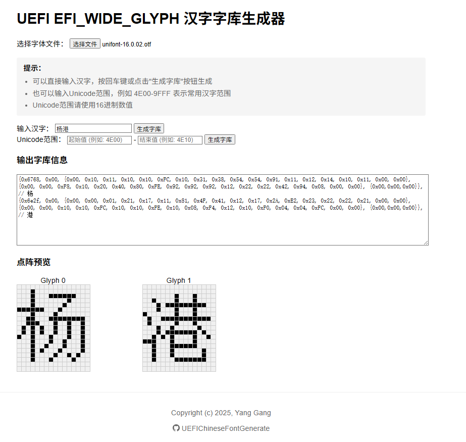
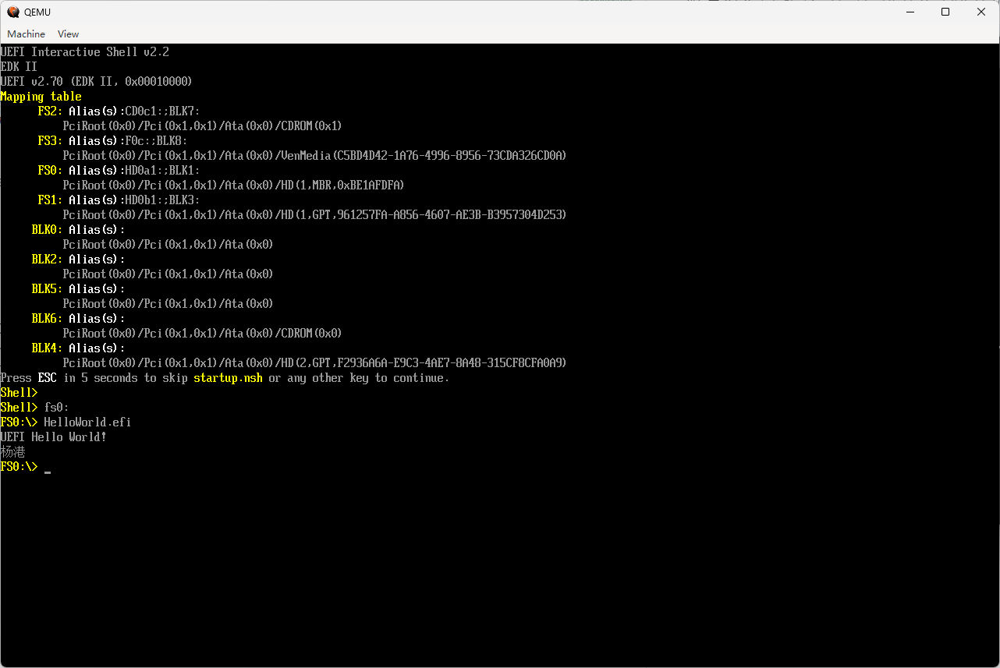
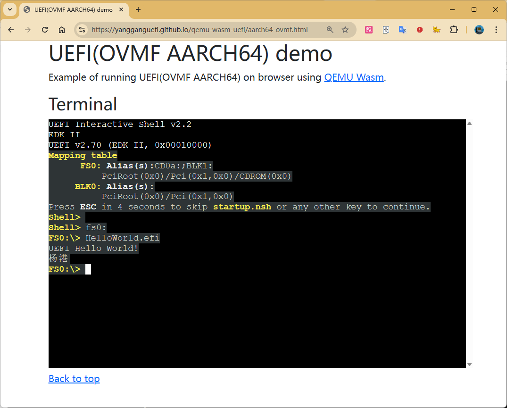

当下的主流 BIOS 应该都提供了中文（多语言）的支持。对于这些商用 BIOS，如果没有相应的代码，其实现细节我们不得而知。
虽然你也可以通过一些逆向手段做一些了解，但是过程可能会让人稍微有些难受。

如果你只是想比较轻松的了解并且做一些实际的实验，本文将会带你在开源的 UEFI 开发环境 Edk2 中实现一个简单的中文字库。

### 0x00 规范

在 UEFI Specification 的 Human Interface Infrastructure（HII，人机界面基础设施）章节中右字体相关的介绍。
本文关注的是其中的 Simplified Font Package（简化字体包）。
> The simplified font package describes the font glyphs for the standard 8x19 pixel (narrow) and 16x19
> (wide) fonts. Other fonts should be described using the normal Font Package.
> A simplified font package consists of a header and two types of glyph structures—standard-width
> (narrow) and wide glyphs.

简化字体包是由 Header 和一系列字形（glyph）结构组成的，它的定义如下：

```
///
/// A simplified font package consists of a font header
/// followed by a series of glyph structures.
///
typedef struct _EFI_HII_SIMPLE_FONT_PACKAGE_HDR {
  EFI_HII_PACKAGE_HEADER    Header;
  UINT16                    NumberOfNarrowGlyphs;
  UINT16                    NumberOfWideGlyphs;
  // EFI_NARROW_GLYPH       NarrowGlyphs[];
  // EFI_WIDE_GLYPH         WideGlyphs[];
} EFI_HII_SIMPLE_FONT_PACKAGE_HDR;
```

`NumberOfNarrowGlyphs` 和 `NumberOfWideGlyphs` 分别是字体包中窄字形和宽字形的数量，而紧随其后的 `NarrowGlyphs[]` 和 `WideGlyphs[]` 便是包含相应数量字形的一个大数组。这两个数组，便是本文讲的字库。

### 0x01 窄字形字库

窄字形是 8\*19 像素的点阵字。

```
#define EFI_GLYPH_HEIGHT       19

///
/// The EFI_NARROW_GLYPH has a preferred dimension (w x h) of 8 x 19 pixels.
///
typedef struct {
  ///
  /// The Unicode representation of the glyph. The term weight is the
  /// technical term for a character code.
  ///
  CHAR16    UnicodeWeight;
  ///
  /// The data element containing the glyph definitions.
  ///
  UINT8     Attributes;
  ///
  /// The column major glyph representation of the character. Bits
  /// with values of one indicate that the corresponding pixel is to be
  /// on when normally displayed; those with zero are off.
  ///
  UINT8     GlyphCol1[EFI_GLYPH_HEIGHT];
} EFI_NARROW_GLYPH;
```

`GlyphCol1[EFI_GLYPH_HEIGHT]` 是具体的字形。每一个 `GlyphCol1` 是点阵中的一行，共 8 个 bit，每个 bit 代表一个像素，bit 为 1 的像素组合起来就是对应的字形。

UEFI 规范要求平台要支持一个包含基础拉丁字符集的字体。
> UEFI requires platform support of a font containing the basic Latin character set.

Edk2 中已经包含了这部分实现。在 [MdeModulePkg\Universal\Console\GraphicsConsoleDxe\LaffStd.c](https://github.com/tianocore/edk2/blob/master/MdeModulePkg/Universal/Console/GraphicsConsoleDxe/LaffStd.c) 中的 `gUsStdNarrowGlyphData` 便包含了这些窄字形：

```
EFI_NARROW_GLYPH  gUsStdNarrowGlyphData[] = {
  //
  // Unicode glyphs from 0x20 to 0x7e are the same as ASCII characters 0x20 to 0x7e
  //
  { 0x0020,                                     0x00, { 0x00, 0x00, 0x00, 0x00, 0x00, 0x00, 0x00, 0x00, 0x00, 0x00, 0x00, 0x00, 0x00, 0x00, 0x00, 0x00, 0x00, 0x00, 0x00 }
  },
  { 0x0021,                                     0x00, { 0x00, 0x00, 0x00, 0x18, 0x3C, 0x3C, 0x3C, 0x18, 0x18, 0x18, 0x18, 0x18, 0x00, 0x18, 0x18, 0x00, 0x00, 0x00, 0x00 }
  },
  //
  // ...
  //
  { (CHAR16)ARROW_RIGHT,                        0x00, { 0x00, 0x00, 0x00, 0x00, 0x00, 0x08, 0x0C, 0x0C, 0xFE, 0xFE, 0x0C, 0x0C, 0x08, 0x00, 0x00, 0x00, 0x00, 0x00, 0x00 }
  },

  { 0x0000,                                     0x00, { 0x00, 0x00, 0x00, 0x00, 0x00, 0x00, 0x00, 0x00, 0x00, 0x00, 0x00, 0x00, 0x00, 0x00, 0x00, 0x00, 0x00, 0x00, 0x00 }
  }                                                                                                                 // EOL
};
```

这个窄字形字库会在 [MdeModulePkg\Universal\Console\GraphicsConsoleDxe\GraphicsConsole.c](https://github.com/tianocore/edk2/blob/master/MdeModulePkg/Universal/Console/GraphicsConsoleDxe/GraphicsConsole.c) 的 `RegisterFontPackage()` 中通过 `HiiAddPackages` 注册。

```
  //
  // Add 4 bytes to the header for entire length for HiiAddPackages use only.
  //
  //    +--------------------------------+ <-- Package
  //    |                                |
  //    |    PackageLength(4 bytes)      |
  //    |                                |
  //    |--------------------------------| <-- SimplifiedFont
  //    |                                |
  //    |EFI_HII_SIMPLE_FONT_PACKAGE_HDR |
  //    |                                |
  //    |--------------------------------| <-- Location
  //    |                                |
  //    |     gUsStdNarrowGlyphData      |
  //    |                                |
  //    +--------------------------------+

  PackageLength = sizeof (EFI_HII_SIMPLE_FONT_PACKAGE_HDR) + mNarrowFontSize + 4;
  Package       = AllocateZeroPool (PackageLength);
  ASSERT (Package != NULL);

  WriteUnaligned32 ((UINT32 *)Package, PackageLength);
  SimplifiedFont                       = (EFI_HII_SIMPLE_FONT_PACKAGE_HDR *)(Package + 4);
  SimplifiedFont->Header.Length        = (UINT32)(PackageLength - 4);
  SimplifiedFont->Header.Type          = EFI_HII_PACKAGE_SIMPLE_FONTS;
  SimplifiedFont->NumberOfNarrowGlyphs = (UINT16)(mNarrowFontSize / sizeof (EFI_NARROW_GLYPH));

  Location = (UINT8 *)(&SimplifiedFont->NumberOfWideGlyphs + 1);
  CopyMem (Location, gUsStdNarrowGlyphData, mNarrowFontSize);

  //
  // Add this simplified font package to a package list then install it.
  //
  mHiiHandle = HiiAddPackages (
                 &mFontPackageListGuid,
                 NULL,
                 Package,
                 NULL
                 );
```

接下来，我们便可以参考这段逻辑来注册一个宽字形字库。

### 0x02 宽字形字库

和窄字形类似，宽字形是 16\*19 像素的点阵字，参考它的结构体定义，不难发现它是由 `GlyphCol1` `GlyphCol2` 组成，即两个 8\*19 的字形（左右各半）。

```
///
/// The EFI_WIDE_GLYPH has a preferred dimension (w x h) of 16 x 19 pixels, which is large enough
/// to accommodate logographic characters.
///
typedef struct {
  ///
  /// The Unicode representation of the glyph. The term weight is the
  /// technical term for a character code.
  ///
  CHAR16    UnicodeWeight;
  ///
  /// The data element containing the glyph definitions.
  ///
  UINT8     Attributes;
  ///
  /// The column major glyph representation of the character. Bits
  /// with values of one indicate that the corresponding pixel is to be
  /// on when normally displayed; those with zero are off.
  ///
  UINT8     GlyphCol1[EFI_GLYPH_HEIGHT];
  ///
  /// The column major glyph representation of the character. Bits
  /// with values of one indicate that the corresponding pixel is to be
  /// on when normally displayed; those with zero are off.
  ///
  UINT8     GlyphCol2[EFI_GLYPH_HEIGHT];
  ///
  /// Ensures that sizeof (EFI_WIDE_GLYPH) is twice the
  /// sizeof (EFI_NARROW_GLYPH). The contents of Pad must
  /// be zero.
  ///
  UINT8     Pad[3];
} EFI_WIDE_GLYPH;
```

对于 `GraphicsOutput` 设备，宽窄两种字形，最终会在 [Edk2\MdeModulePkg\Universal\HiiDatabaseDxe\Font.c](https://github.com/tianocore/edk2/blob/master/MdeModulePkg/Universal/HiiDatabaseDxe/Font.c#L1624) 中绘制到屏幕。

### 0x03 如何获取宽字形的数据

当前已经有一些点阵字体生成工具可用。但我还是想有一个能即开即用，能自由选择字体，并预览的小工具。并且基于前面的内容，我们也了解了字形的数据结构。于是，便有了 [https://yangganguefi.github.io/UEFIChineseFontGenerate/](https://yangganguefi.github.io/UEFIChineseFontGenerate/)。

打开网页后，选择一个字体文件，然后点击`生成字库`，便可以输出 `EFI_WIDE_GLYPH` 格式的数据，并提供一个点阵预览。



### 0x03 注册宽字形字库

参考前面窄字形的注册，我们可以单独写一个模块 `ChineseFontDxe` 来注册宽字体。

其中的主体代码如下：

```
EFI_WIDE_GLYPH gZhWideGlyphData[] = {
  //
  // 生成字库信息...
  //
};

UINT32  mZhWideFontSize =  sizeof (gZhWideGlyphData);

VOID
EFIAPI
RegisterWideFontPackage (
  IN  EFI_EVENT  Event,
  IN  VOID       *Context
  )
{
  EFI_STATUS                       Status;
  EFI_HII_SIMPLE_FONT_PACKAGE_HDR  *SimplifiedFont;
  UINT32                           PackageLength;
  UINT8                            *Package;
  UINT8                            *Location;
  EFI_HII_DATABASE_PROTOCOL        *HiiDatabase;

  //
  // Locate HII Database Protocol
  //
  Status = gBS->LocateProtocol (
                  &gEfiHiiDatabaseProtocolGuid,
                  NULL,
                  (VOID **)&HiiDatabase
                  );
  if (EFI_ERROR (Status)) {
    return;
  }

  //
  // Add 4 bytes to the header for entire length for HiiAddPackages use only.
  //
  //    +--------------------------------+ <-- Package
  //    |                                |
  //    |    PackageLength(4 bytes)      |
  //    |                                |
  //    |--------------------------------| <-- SimplifiedFont
  //    |                                |
  //    |EFI_HII_SIMPLE_FONT_PACKAGE_HDR |
  //    |                                |
  //    |--------------------------------| <-- Location
  //    |                                |
  //    |     gZhWideGlyphData           |
  //    |                                |
  //    +--------------------------------+

  PackageLength = sizeof (EFI_HII_SIMPLE_FONT_PACKAGE_HDR) + mZhWideFontSize + 4;
  Package       = AllocateZeroPool (PackageLength);
  ASSERT (Package != NULL);

  WriteUnaligned32 ((UINT32 *)Package, PackageLength);
  SimplifiedFont                       = (EFI_HII_SIMPLE_FONT_PACKAGE_HDR *)(Package + 4);
  SimplifiedFont->Header.Length        = (UINT32)(PackageLength - 4);
  SimplifiedFont->Header.Type          = EFI_HII_PACKAGE_SIMPLE_FONTS;
  SimplifiedFont->NumberOfWideGlyphs   = (UINT16)(mZhWideFontSize / sizeof (EFI_WIDE_GLYPH));
  SimplifiedFont->NumberOfNarrowGlyphs = 0;

  Location = (UINT8 *)(&SimplifiedFont->NumberOfWideGlyphs + 1);
  CopyMem (Location, gZhWideGlyphData, mZhWideFontSize);

  DEBUG ((DEBUG_INFO, "Add %d Chinese fonts\n", SimplifiedFont->NumberOfWideGlyphs));

  //
  // Add this simplified font package to a package list then install it.
  //
  mHiiHandle = HiiAddPackages (
                 &mZhWideFontPackageListGuid,
                 NULL,
                 Package,
                 NULL
                 );
  ASSERT (mHiiHandle != NULL);
  FreePool (Package);
}

```

这部分的完整代码已经开源在 Github 上，可以在 [https://github.com/YangGangUEFI/ChineseFontPkg](https://github.com/YangGangUEFI/ChineseFontPkg) 查看。

### 0x04 测试

最终的测试是在 OVMF 中完成。

首先需要将 `ChineseFontDxe` 模块添加到 OVMF 中：

```
#
# .dsc
#

ChineseFontPkg/ChineseFontDxe/ChineseFontDxe.inf

#
# .fdf
#
INF ChineseFontPkg/ChineseFontDxe/ChineseFontDxe.inf
```

然后编写一个测试用的 `UEFI_APPLICATION`，这里我们可以直接 `MdeModulePkg\Application\HelloWorld` 模块的基础上修改，然后验证。

`MdeModulePkg\Application\HelloWorld\HelloWorldStr.uni` 的修改如下，这里建议使用 uni，否则可能会由于文件编码导致最终验证效果达不到预期。

```
#langdef zh-Hans "\wide中文\narrow"
#langdef en-US "English"

#string STR_HELLO_WORLD_CHINESE                 #language en-US "Yang Gang"
                                                #language zh-Hans "\wide杨港\narrow"
```

然后在 `MdeModulePkg\Application\HelloWorld\HelloWorld.c` 的 `UefiMain` 中添加如下代码：

```
  mHiiHandle = HiiAddPackages (
                 &mHelloWorldStringPackGuid,
                 ImageHandle,
                 HelloWorldStrings,
                 NULL
                 );

  EFI_STRING ChineseStr;
  ChineseStr = HiiGetString (mHiiHandle, STRING_TOKEN(STR_HELLO_WORLD_CHINESE), "zh-Hans");
  Print (L"%s\n", ChineseStr);
```

OVMF 编译完成后，使用 QEMU 启动到 UEFI Shell，然后运行 `HelloWorld.efi` 可以看到如下输出。



当然，也可以使用之前文章介绍的 [QEMU WASM](https://yangganguefi.github.io/posts/qemu-wasm-uefi/) 来实际动手看一下。结果如下：



### 0xFF

以上只是对于中文的支持，但是方法是相同的，你也可以稍作修改来支持其他的表意文字，如日文、韩文等。

当然，这也只是在 UEFI 环境下显示中文的一种方法。后面可以尝试换一种方法来实现同样的效果，敬请期待……（咕咕咕……）
