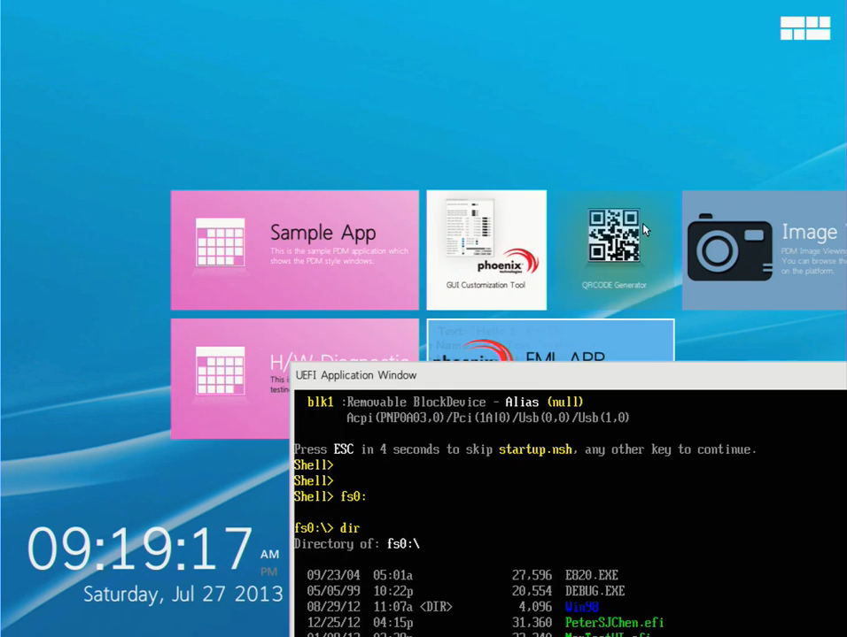
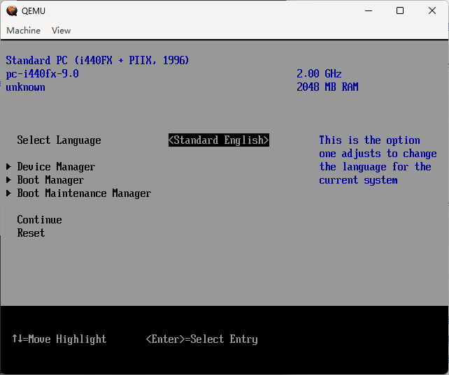
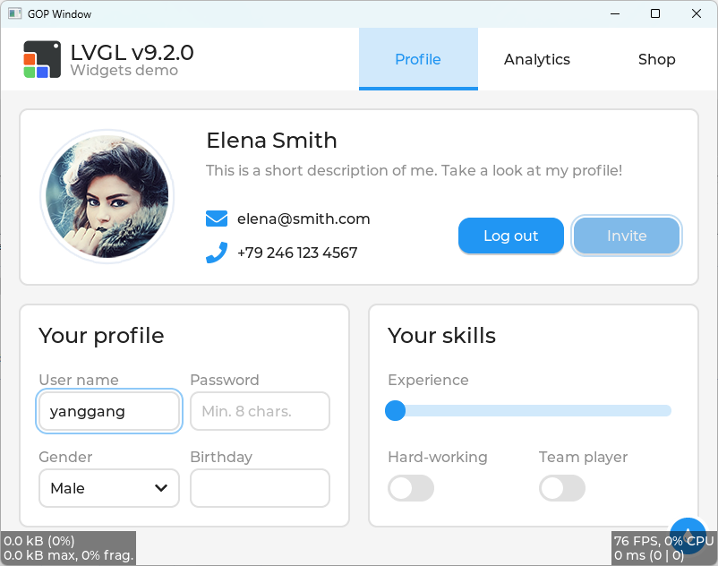
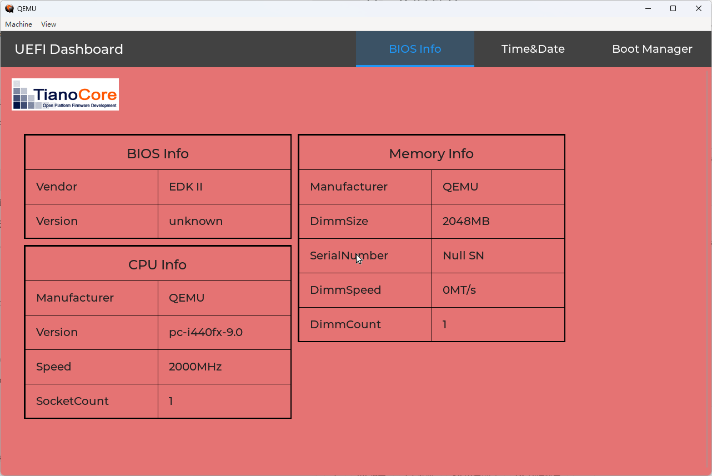
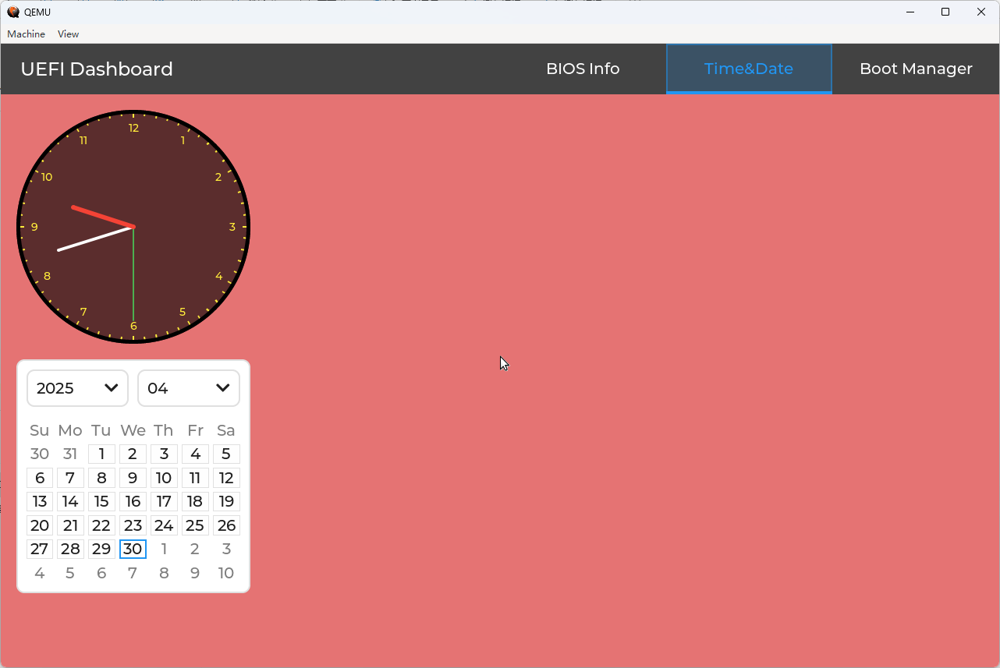
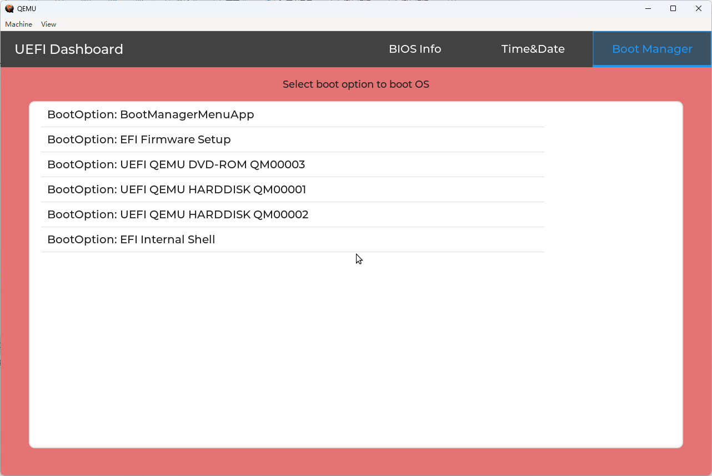

提起 BIOS 多数人可能首先想到的就是经典的蓝白界面。
但是在如今 UEFI 的世界里，越来越多厂商开始提供看起来更炫酷、丰富的图形界面。一些人希望厂商能为 BIOS 提供更现代的 GUI 界面，另一些人则觉得经典的界面就挺方便，厂商别阉割功能就好了。
孰优孰劣也是见仁见智，全凭个人喜好了。

### 0x00 一个有趣的 UEFI GUI 实现

提到 UEFI GUI，这里想先分享一个之前无意中发现的曾经的王者 Phoenix 的一个实现。整体是 Windows8 风格，包括界面布局及动画等。还有比较有趣的一点是，它做了一个 virtual UEFI environment，这样 UEFI Shell 的使用体验会像是 Linux 中的 terminal。



这只是一个例子的截图。在 https://edk2-devel.narkive.com/ejmbHRe5/edk2-vfr-beginner-question#post1 中有更详细的视频展示了这个 Win8 风格的 UEFI GUI BIOS SETUP 的更多特性。（注意，你需要特殊的网络来查看这些视频。）

> 本文的重点不在此，感兴趣的朋友不妨思考一下其中部分特性的实现方法，或者也可以动手尝试一下。

### 0x01 独立的 UEFI GUI 库

虽然不同厂商的 BIOS 开始出现各式各样的图形界面，但其实现是闭源的，我们没法在其之上开发 GUI 程序。而 Edk2 中也依然是基础的蓝白界面。自然，它也没有一个可供开发者使用的 GUI 库。



那么，如果我们想要做一些图形化的 UEFI 小工具要怎么办呢？

不用怕，这其实和把大象装进冰箱一样简单（开个玩笑:)）。第一步，自制或移植一个 GUI 库；第二步，使用这个 GUI 库编写 UEFI APP。

移植总归是更简单些的。只要我们想，任何 C 写的程序我们都能比较方便的移植到 UEFI 环境中（其他语言暂不讨论）。而 LVGL 应该算是使用 C 实现的比较流行的嵌入式图形库了，那么，我们便可以从它入手。

> 另外，不知道你是否有注意到，LVGL 的主线代码也已经支持了 UEFI，这可以很大程度降低移植的难度。不过，本文要讲的内容并不是基于其主线代码，一是本文涉及的主体代码是在 LVGL 主线支持之前开始的；二是会更便于讲一些移植的具体内容（如果基于主线的驱动，那更像是代码导读了）。

### 0x02 将 LVGL 移植到 UEFI 环境

将 C 代码移植到 UEFI 环境的典型步骤其实也不多：

1. 准备一个 .inf，并将源码文件列在 `[Sources]` 下
2. 编译（并解决编译中的问题）

具体到 LVGL 的移植，则需要参考其 porting 的步骤，准备一个 `lvgl_conf.h`，然后在 UEFI 和 LVGL 架起一座显示（输出）、输入、Tick/Timer 等基础接口的桥梁。

#### .inf

由于 inf 中需要显式包含所有要编译的源文件，所以我们需要将 `lvgl/src` 下的大部分 `.c` 描述在 `[Sources]` 下。其他的部分如 `[LibraryClasses]` `[Protocols]` 等按实际使用到的添加即可。

#### `lvgl_conf.h`

一些“平台”配置及 LVGL 特性配置，主要注意的点：
1. `#define LV_COLOR_DEPTH 32`
   这对应到 UEFI 下的：
   ```
   typedef struct {
     UINT8    Blue;
     UINT8    Green;
     UINT8    Red;
     UINT8    Reserved;
   } EFI_GRAPHICS_OUTPUT_BLT_PIXEL;
   ```
2. `LV_USE_STDLIB_xxx` 宏

#### 显示接口
显示上主要要做的事情是，设置一个 callback 用来将要显示的内容绘制到屏幕上，具体一点就是使用 `EFI_GRAPHICS_OUTPUT_PROTOCOL` 的 `EfiBltBufferToVideo` `EFI_GRAPHICS_OUTPUT_BLT_OPERATION`

这里选择使用 `GraphicsOutput->Mode->Info->HorizontalResolution;` 和 `GraphicsOutput->Mode->Info->VerticalResolution;` 作为 `lv_display_t` 的宽高，这样最终显示会按照当前 UEFI 所使用的分辨率铺满屏幕。

主要代码如下：

```
void uefi_disp_flush(lv_display_t * disp, const lv_area_t * area, lv_color32_t * color32_p)
{
  EFI_STATUS                         Status;
  UINTN                              Width, Heigth;
  uefi_disp_data_t                   *uefi_disp_data;
  UINTN                              Delta;

  uefi_disp_data = lv_display_get_driver_data(disp);

  Width = area->x2 - area->x1 + 1;
  Heigth = area->y2 - area->y1 + 1;
  Delta = uefi_disp_data->EfiGop->Mode->Info->HorizontalResolution * sizeof(EFI_GRAPHICS_OUTPUT_BLT_PIXEL);

  Status = uefi_disp_data->EfiGop->Blt (
                                     uefi_disp_data->EfiGop,
                                     (EFI_GRAPHICS_OUTPUT_BLT_PIXEL *)color32_p,
                                     EfiBltBufferToVideo,
                                     (UINTN)area->x1,
                                     (UINTN)area->y1,
                                     (UINTN)area->x1,
                                     (UINTN)area->y1,
                                     Width,
                                     Heigth,
                                     Delta
                                     );

  lv_display_flush_ready(disp);
}


lv_display_t * lv_uefi_disp_create(int32_t hor_res, int32_t ver_res)
{
    EFI_STATUS                    Status;
    EFI_GRAPHICS_OUTPUT_PROTOCOL  *GraphicsOutput;

    Status = gBS->LocateProtocol (&gEfiGraphicsOutputProtocolGuid, NULL, (VOID **) &GraphicsOutput);
    if (EFI_ERROR(Status)) {
        return NULL;
    }

    uefi_disp_data_t * uefi_disp_data = lv_malloc_zeroed(sizeof(uefi_disp_data_t));
    LV_ASSERT_MALLOC(uefi_disp_data);
    if(NULL == uefi_disp_data) return NULL;

    uefi_disp_data->EfiGop = GraphicsOutput;

    lv_display_t * disp = lv_display_create(hor_res, ver_res);
    if(NULL == disp) {
        lv_free(uefi_disp_data);
        return NULL;
    }
    lv_display_set_driver_data(disp, uefi_disp_data);
    lv_display_set_flush_cb(disp, (lv_display_flush_cb_t)uefi_disp_flush);
    lv_display_add_event_cb(disp, uefi_disp_delete_evt_cb, LV_EVENT_DELETE, disp);

    UINTN BufSize = hor_res * ver_res * sizeof (lv_color32_t);
    uefi_disp_data->buffer[0] = malloc (BufSize);
    uefi_disp_data->buffer[1] = malloc (BufSize);

    lv_display_set_buffers(disp, uefi_disp_data->buffer[0], uefi_disp_data->buffer[1], BufSize, LV_DISPLAY_RENDER_MODE_DIRECT);

    return disp;
}
```

#### 输入接口

输入的话对于 UEFI 就是键盘、鼠标。此处仅以键盘的代码为例，需要做的事情就是设置一个读键值的 callback 然后将 `EFI_KEY_DATA` 转换为 LVGL 的 `LV_KEY_xxx`。由以下两个函数完成：

```
static void keypad_read(lv_indev_t * indev_drv, lv_indev_data_t * data)
{
  EFI_STATUS                         Status;
  EFI_SIMPLE_TEXT_INPUT_EX_PROTOCOL  *TxtInEx;
  EFI_KEY_DATA                       KeyData;
  UINT32                             KeyShift;

  Status = gBS->HandleProtocol (gST->ConsoleInHandle, &gEfiSimpleTextInputExProtocolGuid, (VOID **)&TxtInEx);
  Status = TxtInEx->ReadKeyStrokeEx (TxtInEx, &KeyData);
  if (!EFI_ERROR (Status)) {
    switch (KeyData.Key.UnicodeChar) {
      case CHAR_CARRIAGE_RETURN:
        data->key = LV_KEY_ENTER;
        break;

      case CHAR_BACKSPACE:
        data->key = LV_KEY_BACKSPACE;
        break;

      case CHAR_TAB:
        KeyShift = KeyData.KeyState.KeyShiftState;
        data->key = (KeyShift & EFI_SHIFT_STATE_VALID) && (KeyShift & (EFI_RIGHT_SHIFT_PRESSED | EFI_LEFT_SHIFT_PRESSED)) ? LV_KEY_PREV : LV_KEY_NEXT;
        break;

      case CHAR_NULL:
        switch (KeyData.Key.ScanCode) {
        case SCAN_UP:
          data->key = LV_KEY_UP;
          break;
        
        case SCAN_DOWN:
          data->key = LV_KEY_DOWN;
          break;

        case SCAN_RIGHT:
          data->key = LV_KEY_RIGHT;
          break;

        case SCAN_LEFT:
          data->key = LV_KEY_LEFT;
          break;

        case SCAN_ESC:
          data->key = LV_KEY_ESC;
          break;

        case SCAN_DELETE:
          data->key = LV_KEY_DEL;
          break;

        case SCAN_PAGE_DOWN:
          data->key = LV_KEY_NEXT;
          break;

        case SCAN_PAGE_UP:
          data->key = LV_KEY_PREV;
          break;

        case SCAN_HOME:
          data->key = LV_KEY_HOME;
          break;

        case SCAN_END:
          data->key = LV_KEY_END;
          break;

        default:
          break;
        }
        break;

      case CHAR_LINEFEED:
        break;

      default:
        data->key = KeyData.Key.UnicodeChar;
        break;
    }

    data->state = LV_INDEV_STATE_PRESSED;
  } else {
    data->state = LV_INDEV_STATE_RELEASED;
  }

}


lv_indev_t * lv_uefi_keyboard_create(void)
{
    lv_indev_t * indev = lv_indev_create();
    LV_ASSERT_MALLOC(indev);
    if(indev == NULL) {
        return NULL;
    }

    lv_indev_set_type(indev, LV_INDEV_TYPE_KEYPAD);
    lv_indev_set_read_cb(indev, keypad_read);

    return indev;
}
```

鼠标的处理类似，也是设置回调函数，通过 `EFI_SIMPLE_POINTER_PROTOCOL` 或 `EFI_ABSOLUTE_POINTER_PROTOCOL` 读取并处理鼠标坐标然后传递给 `lv_point_t` 的 `x` `y`。

另外，鼠标还需要一个光标，可以参考 [mouse_cursor_icon.c](https://github.com/lvgl/lv_web_emscripten/blob/master/mouse_cursor_icon.c)。

> 代码就不贴上来了，具体实现都已经放到 Github 上，感兴趣的话可以去看一看。（链接在下面:)）

#### Tick/Timer

让 LVGL 有`时间观念`。使用 `gBS->Stall` 即可，大致如下：

```
while (1) {
  lv_timer_handler();
  gBS->Stall (10 * 1000);
  lv_tick_inc(10);
}
```

#### CLIB

在 `lv_conf.h` 中我们有如下配置：
```
#define LV_USE_STDLIB_MALLOC    LV_STDLIB_CLIB
#define LV_USE_STDLIB_STRING    LV_STDLIB_CLIB
```

所以可以参考 Edk2 其他开源代码移植的方式，准备一个 `LvglUefiPort.c` 和 `LvglUefiPort.h` （以及一些 stdxxx.h），然后在编译时缺啥补啥，完善这个 wrapper。

#### 编译
完成以上操作，便可以开始编译这个模块。编译过程中的报错（如 CLIB 相关）需要我们解决，警告部分我们可以有选择的修复或者在 inf 中添加 `[BuildOptions]` 然后禁用。

以上几部分提到的代码均在 [https://github.com/YangGangUEFI/LvglPkg](https://github.com/YangGangUEFI/LvglPkg)。感兴趣的朋友可以去看一看，然后也可以提一些建议、捉捉虫。

#### Demo 测试

不出意外，到这里移植已经完成（至少编译通过了），但是还需要一个程序来验证验证移植的效果。我们可以选择 `lvgl\demos\widgets\lv_demo_widgets.c`，在 `UefiMain` 中调用这个 demo 的入口函数（注意 `lv_conf.h` 和 inf 也要更新，包含 Demo 的源文件），重新编译后，把 .efi 拿到 EmulatorPkg 的 WinHost 或 QEMU+OVMF 中验证即可。



Demo 看起来显示正常，键盘输入也没问题。接下来，我们便可以尝试做一个自己的小工具了。

### 0x04 UEFI Dashboard

以下是一个半成品 UEFI Dashboard 的截图。

来自 `EDKII_PLATFORM_LOGO_PROTOCOL` 的 logo 以及来自 SMBIOS 的一些信息：


来自 `EFI_TIME` 的时间信息：


以及启动项：


当前这个 APP 功能还是比较简陋的，并且界面也有些杂乱。功能的事情交给时间，界面上 LVGL 现在也有了自己的 [LVGL's UI Editor](https://github.com/lvgl/lvgl_editor)，似乎也更能方便“设计”界面了。咕咕咕...

[UefiDashboard](https://github.com/YangGangUEFI/LvglPkg/tree/master/Application/UefiDashboard) 的源码也在 [LvglPkg](https://github.com/YangGangUEFI/LvglPkg) 仓库中，感兴趣的朋友也可以帮忙捉捉虫~

### 0xFF

当前移植的 LVGL 还只是能用来做一些 `UEFI_APPLICATION`（当然在 `DXE_DRIVER` 中也可以用它），后面有时间也许可以将其嵌入到 `DisplayEngine/SetupBrowser/CustomizedDisplayLib` 来替换整个 Edk2 SETUP 的显示风格。

另一方面，也许一个“原生”的 GUI 库更能让人兴奋。这可能在某种程度上有点像 [mu_plus](https://github.com/microsoft/mu_plus)，但是它又不够足够“独立”，也许可以有一个 mu_plus as `LibraryClasses`？

不过，在挖新坑之前还是尽量填平旧坑，当前的 [LvglPkg](https://github.com/YangGangUEFI/LvglPkg) 应该还有些 bug 以及需要优化的地方，其他的就还是先放在 Idea 池吧。
