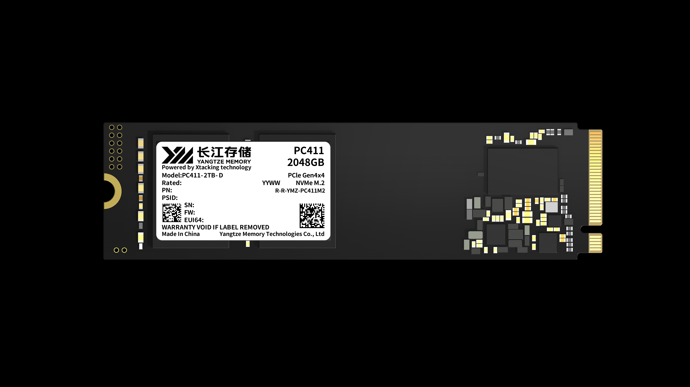

大多数 BIOS 厂商都会提供一个硬盘密码（HDD Password）功能，
但出于种种原因（大多是忘记密码后会很麻烦）你可能并没有使用过它。

最近在测试一个问题时，我非常“快速”地给一块 NVMe 设置了一个常用的密码。
但就在设置完再次启动 BIOS 时，输入密码解锁时却一直提示密码不正确。

于是赶紧再尝试了不同大小写的组合，结果还都是密码不正确。
眼看着一块硬盘就要这样折在我手上，突然想起来还有个 PSID 的东西。

### 0x00 什么是 PSID

NVMe 属于 Self-Encrypting Drive (SED)，BIOS 提供的 NVMe Opal Password 便是使用
TCG Storage Opal Security Subsystem Class (SSC) 所定义的接口与硬盘交互（设置密码），
写入存储设备的用户数据的加密则由存储设备控制器内部的专用硬件来完成。

PSID (Physical Security ID) 是 TCG Opal SSC 中的一个特性，其主要作用提供一个
在忘记密码时的恢复机制（PSID Revert）。注意，这种恢复是破坏性的。

> [TCG_Storage-Opal_Feature_Set_PSID_v1.00_r1.00.pdf](https://trustedcomputinggroup.org/wp-content/uploads/TCG_Storage-Opal_Feature_Set_PSID_v1.00_r1.00.pdf)
> 
> The goal of the PSID Feature Set is to:
> 
>   • Define an authority/credential pair whose C_PIN object’s PIN column value is not discoverable via the
>     interface.
> 
>   • Provide access control settings that permit invocation of the Revert method if the PSID authority has
>     been successfully authenticated.
> 
> The primary use case for this is one where the SID is not known, or manageability of the device has been lost,
> and the owner wishes to attempt to reset the device to OFS via the Revert method defined in [3].
> Because the PSID credential value is specified such that it is not discoverable via the interface, it is necessary
> that the credential value be delivered via an alternative mechanism. Examples of these mechanisms include
> printing the PSID credential on a device label; or including the value as an insert in the device packaging. The
> delivery mechanism is vendor unique.

对于使用方（可以是完成 PSID Revert 的 BIOS 或其他工具）来说，PSID 就是一个 32 个字符的区分大小写的值。

### 0x01 如何获取 PSID

从前文的规范不难发现，PSID 这段字符不可通过接口获取，传递机制由供应商自行决定。

最简单的便是查看硬盘上所贴的标签是否有 PSID 相关的字符。如下图所示（非实际设备图，所以并未包含实际的 PSID）：



如果标签上没有，则可以再检查一下产品包装/说明文档，都没有的话那只有联系产品供应商售后了。

所幸，前面被我忘记密码的长江存储的盘上面有打印这一串 PSID。

### 0x02 使用 PSID Revert

你可以选择使用 [sedutil](https://github.com/Drive-Trust-Alliance/sedutil) 来做这个操作。但是这需要一个环境来运行它。

对于 BIOSer 来说，只要有 BIOS 就足够了。在 Edk2 的 [SecurityPkg\Tcg\Opal\OpalPassword](https://github.com/tianocore/edk2/tree/master/SecurityPkg/Tcg/Opal/OpalPassword) 模块中便支持 PsidRevert 功能。

对于支持的设备，它会提供了一个 checkbox 选项：

```
        checkbox varid = OpalHiiConfig.OpalRequest.PsidRevert,
            prompt  = STRING_TOKEN(STR_DISK_INFO_PSID_REVERT),
            help    = STRING_TOKEN(STR_DISK_INFO_PSID_REVERT_HELP),
            flags   = INTERACTIVE | RESET_REQUIRED,
            key     = 0x800A,
         endcheckbox;
```

如果你勾选了此选项，重启后在下次启动中便会执行 Psid Revert 操作：

```
      if (TempVariable->OpalRequest.PsidRevert != 0) {
        ProcessOpalRequestPsidRevert (Dev, L"Psid Revert:");
      }
```

在 `ProcessOpalRequestPsidRevert()` 中会提示输入相应的 PSID 字符，
之后会调用 `SecurityPkg\Library\TcgStorageOpalLib\TcgStorageOpalUtil.c` 中的 `OpalUtilPsidRevert()` 来执行 Psid Revert 操作。

```
/**
  Creates a session with OPAL_UID_ADMIN_SP as OPAL_ADMIN_SP_PSID_AUTHORITY, then reverts device using Admin SP Revert method.

  @param[in]      Session,           The session info for one opal device.
  @param[in]      Psid               PSID of device to revert.
  @param[in]      PsidLength         Length of PSID in bytes.

**/
TCG_RESULT
EFIAPI
OpalUtilPsidRevert (
  OPAL_SESSION  *Session,
  const VOID    *Psid,
  UINT32        PsidLength
  )
{
  UINT8       MethodStatus;
  TCG_RESULT  Ret;
  UINT32      RemovalTimeOut;

  NULL_CHECK (Session);
  NULL_CHECK (Psid);

  RemovalTimeOut = GetRevertTimeOut (Session);
  DEBUG ((DEBUG_INFO, "OpalUtilPsidRevert: Timeout value = %d\n", RemovalTimeOut));

  Ret = OpalStartSession (
          Session,
          OPAL_UID_ADMIN_SP,
          TRUE,
          PsidLength,
          Psid,
          OPAL_ADMIN_SP_PSID_AUTHORITY,
          &MethodStatus
          );
  if ((Ret == TcgResultSuccess) && (MethodStatus == TCG_METHOD_STATUS_CODE_SUCCESS)) {
    Ret = OpalPyrite2PsidRevert (Session, RemovalTimeOut);
    if (Ret != TcgResultSuccess) {
      //
      // If revert was successful, session was already ended by TPer, so only end session on failure
      //
      OpalEndSession (Session);
    }
  }

  if (MethodStatus != TCG_METHOD_STATUS_CODE_SUCCESS) {
    Ret = TcgResultFailure;
  }

  return Ret;
}
```

不出意外的话，当你正确输入了一串 PSID，等待操作完成后，便可顺利清除硬盘上的密码（当然也包含数据）。

前面被我忘记（搞错）密码的硬盘，这时也就得救了。

### 0xFF 后话（可能你并无法使用上面的方法）

Edk2 中的 OpalPassword 是比较独立的模块，对于工程师来说，可以很方便的引入到 BIOS 中。

当然你可能还想问，前面都能设置 NVMe 密码了为什么还要引入这一个？

当然是功能“阉割”了。（各家 BIOS 的“阉割”确实会让不少人气愤，为什么要把 BIOS 功能这么“精简”！）

不过，正是模块的独立，理论上也可以很方便的改造成一个 UEFI_APPLICATION，这样似乎能更方便使用。（咕咕咕~~~）
