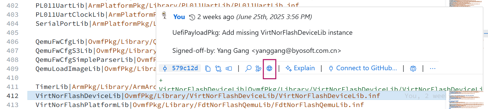
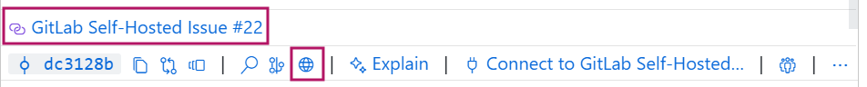

VS Code 中的 GitLens 插件提供了 Line Blame 信息，
这些信息可以在一定程度上帮助我们快速了解某些代码修改的原因。

但有时候想要了解某一点改动的细节，可能还会要跳转到如 GitHub 的 PR 页面去查看是否有更多信息。
此时只要点击在 Line Blame 上悬停鼠标时弹出的 Commit Hover 中的小地球图标，便会在浏览器打开对应的 Commit。



一般这个页面会关联到对应的 PR，点击它便能跳转到 PR 页面。

但是，对于自建 git（如 GitLab）的仓库，默认是无法完成这个操作的。
在 Commit Hover 中并不会有这样一个小地球图标。

不过 GitLens 提供了接口去配置，根据[官方文档](https://help.gitkraken.com/gitlens/gitlens-settings/#remote-provider-integration-settings)提供的方法，在 `.vscode\settings.json` 中添加如下的配置，注意要将 `your-git-url.xxx` 替换为实际的网站/IP。


```json
  "gitlens.remotes": [
    {
      "domain": "your-git-url.xxx",
      "type": "GitLab",
      "protocol": "http",
      "name": "GitLab Self-Hosted",
      "urls": {
        "repository": "{{protocol}}://{{domain}}/{{owner}}/{{repository}}",
        "branches": "{{protocol}}://{{domain}}/{{owner}}/{{repository}}/-/branches",
        "branch": "{{protocol}}://{{domain}}/{{owner}}/{{repository}}/-/tree/{{branch}}",
        "commit": "{{protocol}}://{{domain}}/{{owner}}/{{repository}}/-/commit/{{id}}",
        "file": "{{protocol}}://{{domain}}/{{owner}}/{{repository}}/-/blob/{{branch}}/{{file}}",
        "fileInBranch": "{{protocol}}://{{domain}}/{{owner}}/{{repository}}/-/blob/{{branch}}/{{file}}",
        "fileInCommit": "{{protocol}}://{{domain}}/{{owner}}/{{repository}}/-/blob/{{id}}/{{file}}",
        "fileLine": "{{protocol}}://{{domain}}/{{owner}}/{{repository}}/-/blob/{{branch}}/{{file}}#L{{line}}",
        "fileRange": "{{protocol}}://{{domain}}/{{owner}}/{{repository}}/-/blob/{{branch}}/{{file}}#L{{startLine}}-{{endLine}}"
      }
    }
  ],
```


然后再打开一份代码，随便看一下某一行代码的 Commit Hover，可以看到出现了小地球的图标，点击它便能跳转到对应的网页，然后查看对应 Commit 的 Merge Request 或 Issue 等信息。

 

最后，可以将你的 domain 加入 VS Code 的 Trusted Domains 中，这样就不用每次点确认再跳转网页了。

如果你是自建的其他 git，参考官方文档简单修改下配置即可。
