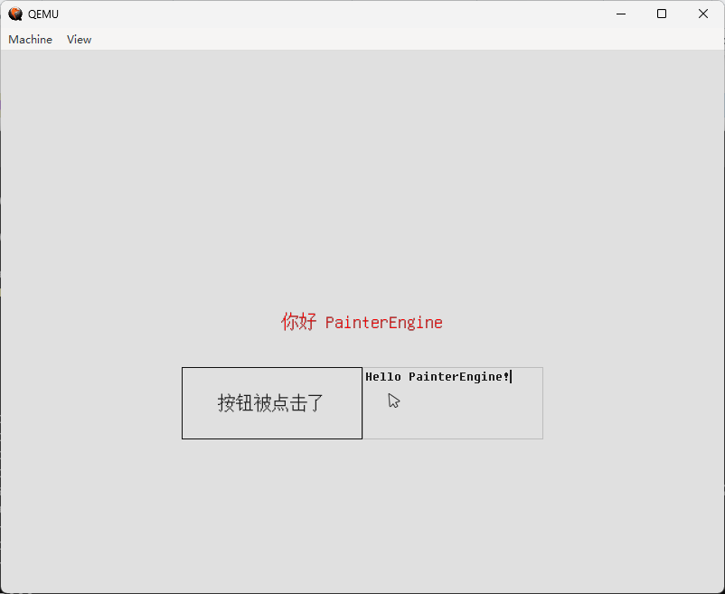

前段时间分享了一个跑在 [UEFI 环境中的 PainterEngine Demo](https://www.zhihu.com/pin/1918078246169314802)。最近又在这个基础上添加了输入（键鼠）、文件读取的相关支持。现在有些时间，便记录一下将其移植到 UEFI 环境下的一些心得。主要包含一些关键的移植步骤/技巧，以及遇到的一些问题。

### 0x00 基础的文件

首先需要新建一个 .inf 文件，然后将 `PainterEngine` 的 `core`、`kernel`、`runtime` 目录下的源码文件列在 `[Sources]` 下。

然后可以参考 `PainterEngine\platform\standalone\px_main.c` 添加一个适用于 UEFI 的 `px_main.c`。

最开始，先只关注输出（即显示）。即使用 UEFI 的 `Gop->Blt` 将 PainterEngine 的 `surfaceBuffer`/`px_color` 绘制出来。

这部分主要的代码如下：
```
void uefi_gop_render(px_color* gram, px_int width, px_int height)
{
  EFI_STATUS  Status;
  UINTN       Delta;

  Delta = mEfiGop->Mode->Info->HorizontalResolution * 4;

  Status = mEfiGop->Blt (
                      mEfiGop,
                      (EFI_GRAPHICS_OUTPUT_BLT_PIXEL *)(gram),
                      EfiBltBufferToVideo,
                      0,
                      0,
                      0,
                      0,
                      width,
                      height,
                      Delta
                      );
}

EFI_STATUS
EFIAPI
PainterEngineUefiMain (
  IN EFI_HANDLE        ImageHandle,
  IN EFI_SYSTEM_TABLE  *SystemTable
  )
{
  px_int screen_width=240;
  px_int screen_height=320;
  EFI_STATUS  Status;

  Status = gBS->LocateProtocol (&gEfiGraphicsOutputProtocolGuid, NULL, (VOID **) &mEfiGop);
  if (!EFI_ERROR(Status)) {
    screen_width = mEfiGop->Mode->Info->HorizontalResolution;
    screen_height = mEfiGop->Mode->Info->VerticalResolution;
  }

  if (!PX_ApplicationInitialize(&App,screen_width,screen_height))
  {
    return 0;
  }

  timelasttime=PX_TimeGetTime();
  while (1)
  {
    px_dword now=PX_TimeGetTime();
    px_dword elapsed=now-timelasttime;
    timelasttime= now;
    PX_ApplicationUpdate(&App,elapsed);
    PX_ApplicationRender(&App,elapsed);
    uefi_gop_render(App.runtime.RenderSurface.surfaceBuffer, App.runtime.RenderSurface.width, App.runtime.RenderSurface.height);
  }
  
  return 0;
}
```

需要注意的是，`PainterEngineUefiMain` 是 inf 中的 `ENTRY_POINT`，也即最终的 UEFI App 的入口。

而实际我们的 GUI 程序是另一个 `main` 函数，他在 `PainterEngine.h` 中会被替换成 `px_main`，并在 `PX_ApplicationInitialize()` 中调用。

有一些 `PainterEngine` 中要使用，但是对于输出无关紧要的接口，暂时不作不支持，可以先不做具体实现。

然后，可以像 `PainterEngine` 文档中所述，先写一个最简单的 `main` 函数（注意，函数名必须要是 `main`）。这些（GUI 程序代码）建议放在一个独立的 c 文件中，当然它也要列在 `[Sources]` 下。

至此，我们可以将 inf 添加到合适的 dsc 中，然后编译这个模块。当然也可以新建一个专用的 dsc 文件。编译时可能会有些警告等，我们尽量保证不去对原本的 PainterEngine 做改动，所以对于警告可以直接在 inf 的 `[BuildOptions]` 将其忽略。

### 0x01 有关 memset memcpy 等

由于代码写法及不同版本编译器行为，在使用 VS2022 编译时，会被编译器插入一些 `memxxx` 相关代码进行优化，在 link 时会出错。edk2 中有一个 `CompilerIntrinsicsLib`，虽然它已经从 `ArmPkg` 中移到了 `MdePkg`，但仍旧只适用于 ARM 平台，为其添加一些基本的 X64 支持会有一些阻力（当前 edk2 建议避免在 X64 上出现可能让编译器插入 `memxxx` 的写法）。所以为了移植的简便，以及不对原有代码做过多改动，当前可以在 `[Sources]` 下加一个源文件，来实现这几个基本的函数。

类似的还有 `_fltused` 及 `__chkstk`，前者为了简便直接添加一行 `int  _fltused = 1;` 即可。`__chkstk` 应该是 `App->cache[]` 这个超大数组让编译器引入了它，这个在 edk2 的 BaseLib 中有一份，但当前被限制只用于 GCC（提交了一个 PR，不过目前还在等待 review 中），所以当前还是需要为 MSFT 在 inf 中额外加一个 `__chkstk` 的空实现。

### 0x02 时间接口

需要特别注意的两个时间接口是 `PX_TimeGetTime` 和 `PX_TimeGetTimeUs`，他们的精度是毫秒和微秒。一般 `gRT->GetTime` 获取到的 `EFI_TIME` 中的 `Nanosecond` 都是 0，精度只到秒一级。所以这两个接口无法使用 `EFI_TIME` 来实现。

`TimerLib` 中的 `GetTimeInNanoSecond` 提供了纳秒级别的精度，可以选择使用它来实现。但是 `TimerLib` 是平台相关的，即便是相同的架构可能也有不同的实现，无法做到完全通用。UEFI Spec 提供了一个基于 `TimerLib` 的独立于平台的接口 `EFI_TIMESTAMP_PROTOCOL`，但是考虑到很多平台没有包含 `MdeModulePkg\Universal\TimestampDxe\TimestampDxe.inf`，所以也没法方便的使用它。 

`PainterEngineUefiMain` 中的 `while (1)` 通过两次 `PX_TimeGetTime` 获取的时间相减，得到过去的时间来更新界面（可以理解为 LVGL 中的 tick）。为了能够稍微“通用”一点，当前只能先硬编码一个 `elapsed` 值，如果针对特定平台，则可以使用正确的 `TimerLib` 来获取正确的 `elapsed` 时间。

```
#ifdef REAL_TIMER_LIB
  timelasttime=PX_TimeGetTime();
#endif
  while (1)
  {
#ifdef REAL_TIMER_LIB
    px_dword now=PX_TimeGetTime();
    px_dword elapsed=now-timelasttime;
    timelasttime= now;
#else
    px_dword elapsed = 100;
#endif
    PX_ApplicationUpdate(&App,elapsed);
    PX_ApplicationRender(&App,elapsed);
    uefi_gop_render(App.runtime.RenderSurface.surfaceBuffer, App.runtime.RenderSurface.width, App.runtime.RenderSurface.height);
  }
```

至此，不出意外的话，编译完成之后便能够得到一个像文章开头提到的 Demo 一样的 .efi 文件，可以拿到 QEMU 中测试一下了。

### 0x03 输入接口（键盘、鼠标）

因为有了前面[移植 LVGL](https://yangganguefi.github.io/posts/uefi-edk2-lvgl/) 的经验，所以这部分就简单了些，我们可以把大部分代码直接拿来用，只需要注意一些与 `PainterEngine` 相关的内容，做一些相应的适配即可。

#### 键盘

键值相关的宏为 `PX_VK_`，与 edk2 的 `SCAN_` 等对应即可。

然后根据输入字符或功能按键调用不同接口，更新状态即可。

```
    if (e.Event == PX_OBJECT_EVENT_KEYDOWN) {
      PX_Object_Event_SetKeyDown(&e,str[0]);
    } else if (e.Event == PX_OBJECT_EVENT_STRING) {
      PX_Object_Event_SetStringPtr(&e,&str[0]);
    }
    PX_ApplicationPostEvent(&App,e);
```

#### 鼠标

需要根据鼠标状态的不同数据，组合出不同的 `CURSOR` 事件类型 `PX_OBJECT_EVENT_CURSORxxx`，同时使用 `PX_Object_Event_SetCursorX` 和 `PX_Object_Event_SetCursorY` 来更新当前的鼠标位置。

需要注意，UEFI 环境下不像 Windows 等环境直接有鼠标的光标，所以还需要一些额外的代码来将鼠标光标显示出来。这部分可以参考 `PainterEngine` 的“打狐狸”小游戏，只是我们要绘制的“锤子”变成了一个鼠标光标，然后注册对应的 `PX_OBJECT_EVENT_CURSORMOVE` 和 `PX_OBJECT_EVENT_CURSORDRAG` 事件，这样在鼠标移动时，光标也便能跟随移动到正确位置了。

```
void PX_Object_MouseCursorCreate()
{
	PX_Object_MouseCursor* pmousecursor;
	PX_Object* pObject = PX_ObjectCreateEx(mp, root, 0, 0, 0, 0, 0, 0, PX_OBJECT_TYPE_CURSORBUTTON, 0, PX_Object_MouseCursorRender, PX_Object_MouseCursorFree, 0, sizeof(PX_Object_MouseCursor));
	pmousecursor = PX_ObjectGetDescByType(pObject, PX_OBJECT_TYPE_CURSORBUTTON);
	if (!PX_TextureCreateFromMemory(mp, PX_Object_PainterBox_ImageMouseCursor, sizeof(PX_Object_PainterBox_ImageMouseCursor), &pmousecursor->MouseCursor)) return;
	PX_ObjectRegisterEvent(pObject, PX_OBJECT_EVENT_CURSORMOVE, PX_Object_MouseCursorOnMove, PX_NULL);
	PX_ObjectRegisterEvent(pObject, PX_OBJECT_EVENT_CURSORDRAG, PX_Object_MouseCursorOnMove, PX_NULL);
}
```

#### 针对输入的一些优化

键盘鼠标数据的获取及处理可以放在 `while (1)` 中进行，但是一定程度上这些操作会阻塞界面的更新，导致“卡卡的”感觉。

为了不阻塞 `while (1)`，可以选择使用 `Event` 来处理输入数据，这样“观感”就会好上很多。

```
  Status = gBS->CreateEvent (
                  EVT_TIMER | EVT_NOTIFY_SIGNAL,
                  TPL_NOTIFY,
                  (EFI_EVENT_NOTIFY) CheckEfiInputEvent,
                  (VOID*)NULL,
                  &EfiInputEvent
                  );

  Status = gBS->SetTimer (EfiInputEvent, TimerPeriodic, 10 * 10000);
```

在 `CheckEfiInputEvent` 中获取键鼠数据，并更新相应的状态。

### 0x04 文件接口

实现文件相关接口之后，便可以从文件系统中读取一些资源以实现更丰富的效果。

主要的接口是 `PX_LoadFileToIOData`，其他加载各种特定资源的 `PX_Loadxxx` 接口都依赖它，我们需要实现的也就是它。

代码的主体思路是获取到要读取文件的 DP，然后读取文件，将文件 Buffer 和 Size 传递给 `PX_IO_Data` 即可。主要代码如下，通过 `ImageHandle` 获取当前 efi 所在目录的 DP 然后拼接上具体资源相对 efi 文件的相对路径，然后读取文件。

```
PX_IO_Data PX_LoadFileToIOData(const char path[])
{
  PX_IO_Data io;
  EFI_DEVICE_PATH_PROTOCOL  *FileDp;
  EFI_STATUS                Status;
  EFI_FILE_HANDLE           FileHandle;
  CHAR16                    *Char16Path;

  io.buffer=0;
  io.size=0;
  
  if (mCurrentImageDirDp == NULL) {
    mCurrentImageDirDp = GetCurrentImageDirDp (mImageHandle);
  }

  if (mCurrentImageDirDp) {
    Char16Path = AllocateZeroPool (AsciiStrSize(path) * sizeof(CHAR16));
    AsciiStrToUnicodeStrS(path, Char16Path, (AsciiStrSize(path) * sizeof(CHAR16)));
    FileDp = AppendDevicePath(mCurrentImageDirDp, ConvertTextToDevicePath(Char16Path));
    Status = EfiOpenFileByDevicePath (&FileDp, &FileHandle, EFI_FILE_MODE_READ, 0);
    if (!EFI_ERROR(Status)) {
      EFI_FILE_INFO * FileInfo = LibFileInfo (FileHandle, &gEfiFileInfoGuid);
      UINTN FileBufferSize = FileInfo->FileSize;
      UINT8 *FileBuffer = AllocateZeroPool(FileBufferSize);
      Status = FileHandle->Read (FileHandle, &FileBufferSize, FileBuffer);
      if (!EFI_ERROR(Status)) {
        io.buffer = FileBuffer;
        io.size = FileBufferSize;
      }
    }
    if (Char16Path != NULL) {
      FreePool (Char16Path);
    }
  }

  return io;
}
```

实现这个接口之后，便可以将其他平台已经实现的各种资源加载接口 `PX_Loadxxx` 直接拿来用了。

### 0xFF 最终测试

以上都完成后，便可以写一个简单的 App 来做验证。包含对输出（显示，这肯定要有）、输入（键鼠）、文件读取等接口的使用/测试。

```
int main (
  VOID
  )
{
  EFI_STATUS                   Status;
  EFI_GRAPHICS_OUTPUT_PROTOCOL *EfiGop = NULL;

  Status = gBS->LocateProtocol (&gEfiGraphicsOutputProtocolGuid, NULL, (VOID **) &EfiGop);
  if (!EFI_ERROR(Status)) {
    screen_width = EfiGop->Mode->Info->HorizontalResolution;
    screen_height = EfiGop->Mode->Info->VerticalResolution;
  }

  PainterEngine_Initialize (screen_width, screen_height);

  PainterEngine_LoadFontModule("font/unifont.ttf", PX_FONTMODULE_CODEPAGE_UTF8, 20);

  PainterEngine_DrawText (screen_width/2, screen_height/2, "你好 PainterEngine", PX_ALIGN_CENTER, PX_COLOR(255, 255, 0, 0));

  PX_Object* myButtonObject;
  myButtonObject=PX_Object_PushButtonCreate(mp,root,screen_width/2-200,screen_height/2+50,200,80,"按钮", PainterEngine_GetFontModule());
  PX_ObjectRegisterEvent(myButtonObject,PX_OBJECT_EVENT_EXECUTE,OnButtonClick,0);

  PX_Object* pObject;
  pObject=PX_Object_EditCreate(mp,root,screen_width/2,screen_height/2+50,200,80,0);
  PX_ObjectRegisterEvent(pObject,PX_OBJECT_EVENT_VALUECHANGED, PX_Object_EditOnTextChanged,PX_NULL);

  return EFI_SUCCESS;
}
```

以上的代码会加载一个 ttf 字体，显示一行文字，一个按钮（可以用鼠标点击）和一个输入框（可以使用键盘输入信息）。下面是最终的效果：



上述相关代码已经贡献到 [https://github.com/matrixcascade/PainterEngine](https://github.com/matrixcascade/PainterEngine)，感兴趣的朋友可以去看一看，捉捉虫~
