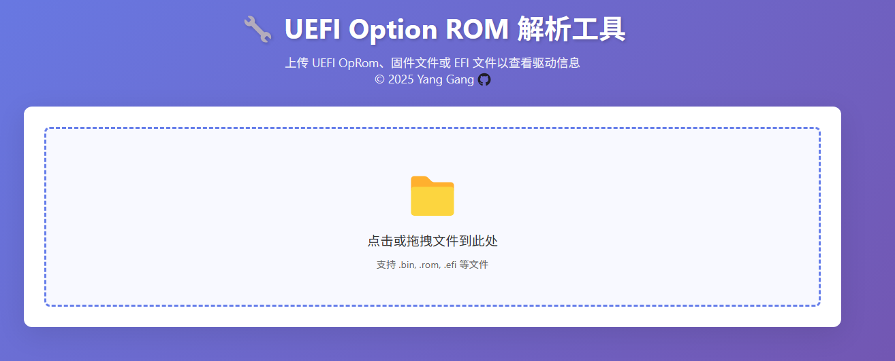
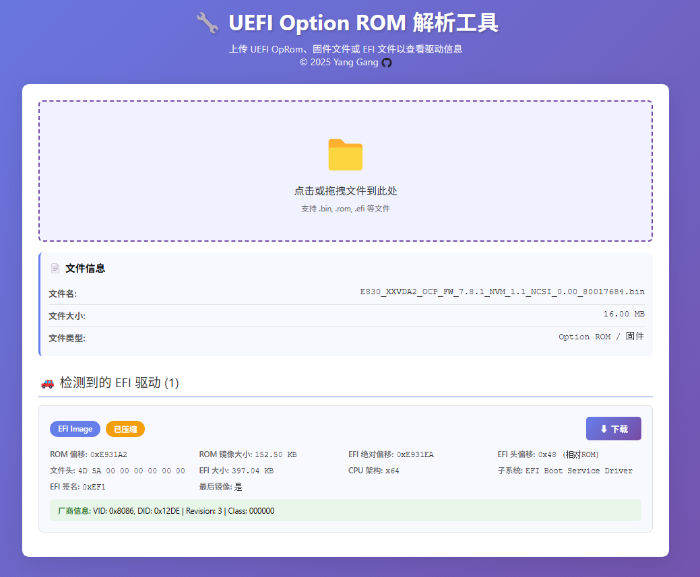
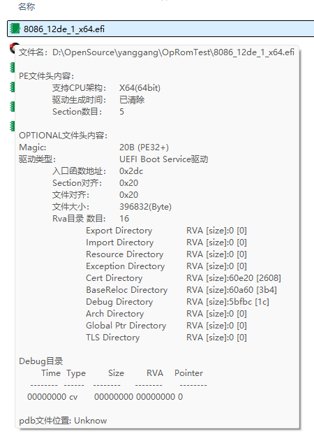
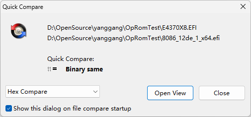

在 BIOS 的开发工作中，难免会遇到一些 PCIe 外插设备的问题，而其中一小部分可能会与它的 OptionROM/设备驱动相关。
一般情况下，这部分并不需要我们关注太多，多数情况可能只是包一下驱动。不过也总有一些时候，我们想要从它的 OpROM 中提取一下驱动（.efi 文件）。

如果你曾经做过这样的操作，那么你应该会有一个小工具来完成提取的工作。

最近我也做了一次这个操作，使用的是一个临时找来的小工具。虽然可以完成操作，但是不够直观。

所以便借助 LLM 来做了一个网页，来实现这个提取的功能。
> 主体是在 Claude（网页端） 完成的，然后又在 Zed 里使用 Gemini Agent 做了一些修补。
> 为什么这么麻烦呢？起初以为 Claude 可以在 2 ~ 3 轮结束战斗，结果一不小心便被限制对话了，然后只好换了，顺便也试试 Gemini 的“实战”效果。
> 所以嘛，要想 Viber Coding 效果好，Token 数量少不了~

废话少说，直接上测试结果：

1. 页面打开之后如下：

    

2. 打开或拖进来一个文件：

    这里选择的是 Intel® Ethernet Network Adapter E830-XXVDA2 for OCP 3.0 的 [FW](https://www.intel.cn/content/www/cn/zh/download/859210/non-volatile-memory-nvm-update-package-for-intel-ethernet-e830-series-efi.html)。

    

    可以看到，展示出了其中包含的 x64 的 efi，点击下载我们可以得到一个 8086_12de_1_x64.efi 文件。
    
3. 提取出来的文件对不对呢

    先用一个 Shell Extension 小工具看一看：
    
    
    
    似乎没啥问题，至少 PE 头是对的。
    
    然后，可以直接下载对应的 [PREBOOT.zip](https://www.intel.cn/content/www/cn/zh/download/15755/intel-ethernet-connections-boot-utility-preboot-images-and-efi-drivers.html) 文件（确保和 FW 都是最新版本的，或者同一版本的），这里面是直接放了 efi 文件，可以直接对比两个二进制文件。
    
    
    
    二进制是一样的，所以提取出来的 efi 应该是没有问题的。不过代码并没有细看，所以如果有问题，估计也只能等下次用上（并且触发了问题）才能直到了。
    
    感兴趣的朋友可以去 [https://yangganguefi.github.io/tools/UefiOpromExtract/UefiOpromExtract.html](https://yangganguefi.github.io/tools/UefiOpromExtract/UefiOpromExtract.html) 试一试。
