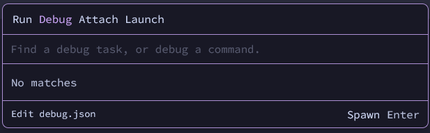
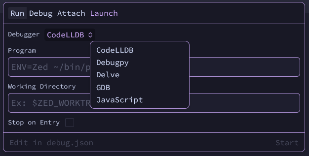
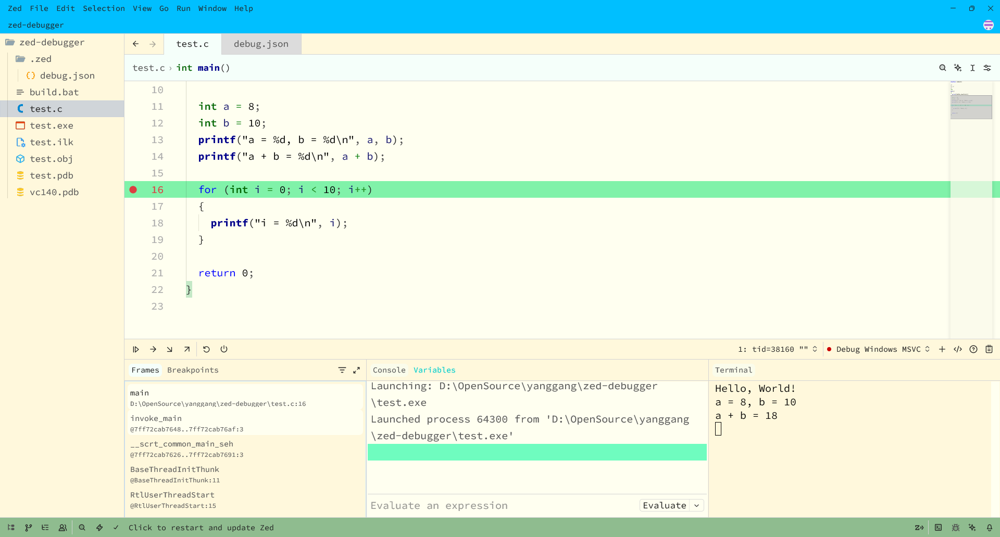
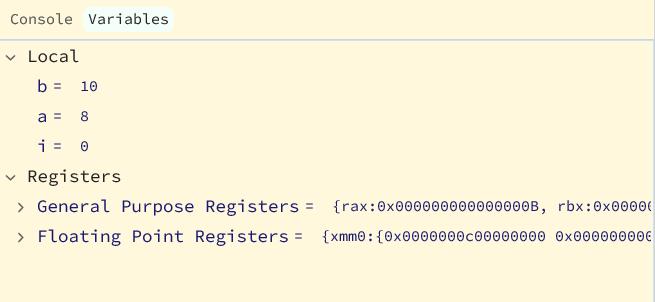

前些天分享了一些关于 [Zed 编辑器的配置](https://zhuanlan.zhihu.com/p/1965102952386626604)，有评论提到 Zed 文档中 debug 相关配置的介绍有些简陋。虽然当时在评论中已经说的差不多了，但为了更便于检索，还是将其拎出来，独成一文，也希望能给尝试使用 Zed Debugger 的朋友一些帮助。

### 一些基本操作

在 Zed 编辑器中，按 `F4`，它会弹出一个弹框，如果是尚未配置 Debugger 的项目，弹框像下面这样：



然后，可以点击 `Launcher`，可以选择/配置要使用的 `Debugger`，要调试的目标程序 `Program` 以及是否在入口处停下等。



### Windows

> 这里只以 LLDB 为例，当然你也可以安装 MinGW 然后尝试一下 GDB

按照前面的步骤，你应该会得到如下一个配置。

```
[
  {
    "label": "Debug Windows - LLDB",
    "cwd": "D:\\OpenSource\\yanggang\\zed-debugger",
    "program": "test.exe",
    "request": "launch",
    "adapter": "CodeLLDB",
    "stopOnEntry": false
  }
]
```

#### 具体的调试

如果你已经生成了待调试的目标程序 `test.exe`，那么可以在某一行设下断点，然后按 `F4`，选择 `Debug Windows - LLDB`，Zed 编辑器会自动下载并启动 CodeLLDB 并加载 `test.exe`，然后开始调试。



在左侧上部的按钮可以用来 Continue/StepIn/StepOut 等，Frames 则显示当前的调用栈，Breakpoints 中可以看到设置的断点信息。


在中间的 Console 中可以使用调试器的命令，Variables 中则显示了当前的变量及寄存器信息。



而右侧的 Terminal 中则是目标程序执行到当前断点的输出内容。

#### 调试前编译

如果把编译和调试放到两个流程/环境，似乎有些笨拙，所以你可以将 `build` 流程放在 debug.json 中，这样就可以一键完成编译然后接着调试了。

可以像这样将 build 流程全部放在 debug.json 中：

```
[
  {
    "label": "Debug Windows MSVC",
    "cwd": "D:\\OpenSource\\yanggang\\zed-debugger",
    "program": "test.exe",
    "request": "launch",
    "adapter": "CodeLLDB",
    "stopOnEntry": false,
    "build": {
      "command": "cmd.exe",
      "args": [
        "/c",
        "call build.bat"
      ]
    }
  }
]
```

也可以单独新建一个 `.zed/tasks.json`：

```
[
  {
    "label": "Debug Build",
    "command": "cmd.exe /c call build.bat"
  }
]
```

然后在 debug.json 中只需要添加一行 `"build": "Debug Build"` 即可（`Debug Build` 对应 tasks.json 中的 `label`）。
这样的好处是可以单独只做 build（`F4`->`Run`->`Debug Build`）。

### Linux

整体的配置几乎没什么差别，主要是两种平台 `build` 命令的不同，以及 `LLDB` 和 `GDB` 的部分配置区别。
下面便直接贴出来具体的配置，需要的朋友参考即可。

#### LLDB

```
    {
        "label": "Debug Linux CodeLLDB",
        "program": "$ZED_WORKTREE_ROOT/test",
        "request": "launch",
        "adapter": "CodeLLDB",
        "stopOnEntry": false,
        "build": {
            "command": "gcc",
            "args": ["-g", "test.c", "-o", "test"],
            "cwd": "$ZED_WORKTREE_ROOT"
        }
    },
```

#### GDB

```
    {
        "label": "Debug Linux GDB",
        "adapter": "GDB",
        "request": "launch",
        "program": "test",
        "stopAtBeginningOfMainSubprogram": true,
        "cwd": "$ZED_WORKTREE_ROOT",
        "build": {
            "command": "gcc",
            "args": ["-g", "test.c", "-o", "test"],
            "cwd": "$ZED_WORKTREE_ROOT"
        }
    },
```

### 怎么用一个特定版本的 LLDB

当前 Zed 与最新版本的 `CodeLLDB` 似乎有些适配上的问题，所以如果想要使用特定版本的 `CodeLLDB` 可以在 settings.json 中按照如下配置：

```
  "dap": {
    "CodeLLDB": {
      // "env": {
      //   "LLDB_USE_NATIVE_PDB_READER": "1"
      // },
      // "binary": "D:\\clang-llvm\\bin\\lldb-dap.exe",
      "binary": "D:\\codelldb-1-11-4\\extension\\adapter\\codelldb.exe"
      // "args": ["--wait-for-debugger"]
    }
  },
```

官方文档中有提到 `"args"`，但似乎并不必要，尤其是在用 `CodeLLDB` 时。
另外也可以使用 LLVM 官方的 `lldb-dap`，不过似乎还有些兼容性问题，后续相关问题修复后 Zed 也许会默认使用官方 `lldb-dap`。
