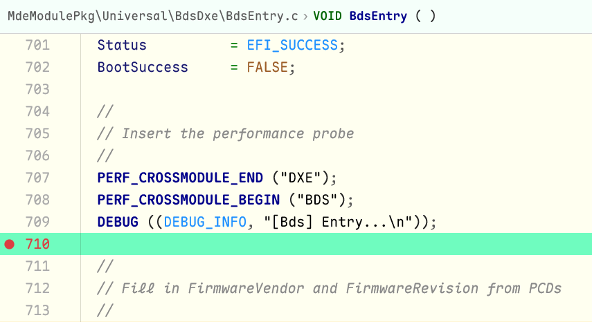
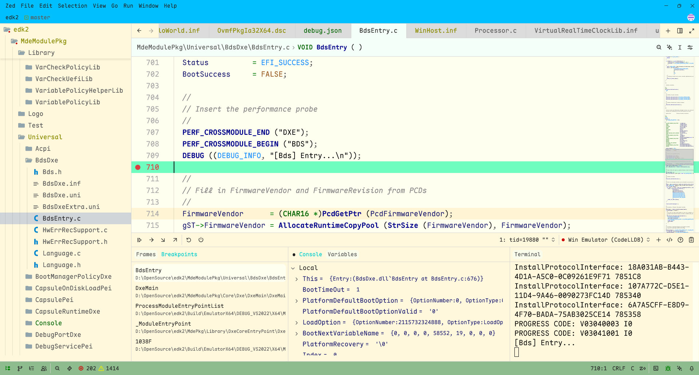
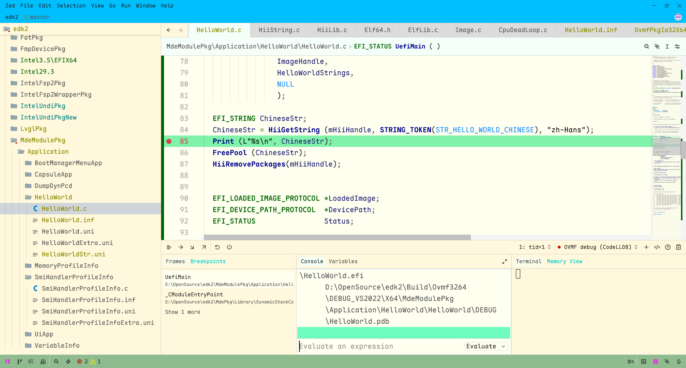
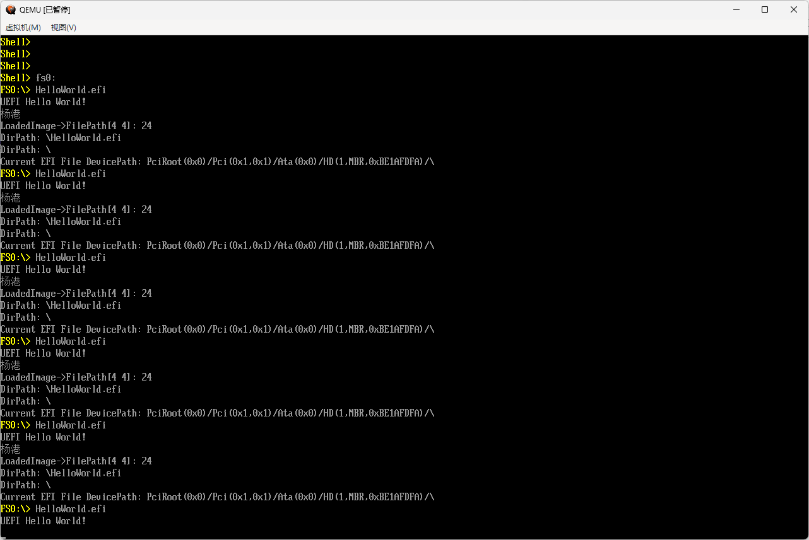
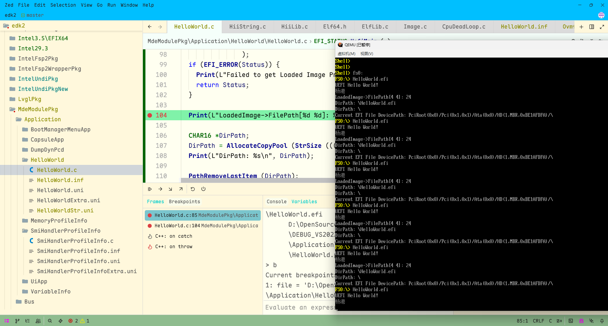

对于 BIOSer 来说，日常 debug 最常用的手段可能就是串口了，加些日志打印，剩下的就是对着代码看了。
不过 [Edk2](https://github.com/tianocore/edk2) 提供了 Emulator 和 OVMF 这样的虚拟平台，
开发人员可以在其上做一些平台无关的验证，对于它们，我们则有机会用上稍微“高级”一些的调试手段。

本文将分享一下如何在 Zed 编辑器中使用 Zed Debugger + LLDB 来调试 Edk2。

> 前情提要：[Zed Debugger | 如何在 Zed 编辑器中调试 C/C++](https://zhuanlan.zhihu.com/p/1971270355617289897)

### EmulatorPkg 的调试

> EmulatorPkg provides an environment where a UEFI environment can be
> emulated under an environment where a full UEFI compatible
> environment is not possible.  (For example, running under an OS
> where an OS process hosts the UEFI emulation environment.)

Emulator 实际上就是一个可执行程序，所以对于它的调试很简单，目标程序就是 `WinHost.exe`。
所以在 `.zed/debug.json` 中添加如下配置即可：

```
  {
    "adapter": "CodeLLDB",
    "label": "Win Emulator (CodeLLDB)",
    "request": "launch",
    "name": "Win Emulator (CodeLLDB)",
    "program": "Build\\EmulatorX64\\DEBUG_VS2022\\X64\\WinHost.exe",
    "stopOnEntry": false,
    "cwd": "D:\\OpenSource\\edk2\\Build\\EmulatorX64\\DEBUG_VS2022\\X64\\"
  }
```

为了验证调试的效果，可以在 `BdsEntry()` 中设置一个断点。



然后按 `F4`，选择 `Win Emulator (CodeLLDB)` 即可。



在右侧的 Terminal 中可以看到，log 输出 `[Bds] Entry...` 后便停下了。
左侧的 Frames 中可以看到详细的调用栈，这对研究一些复杂的调用关系时应该很有用处，
甚至可以单步去观察 UEFI 的大致启动流程。

> 上述适用于 Windows 平台，Unix 的话目标程序就是对应的 `Host` 程序。
> `DEBUG_VS2022` 需要替换为实际所使用的工具链。

### OvmfPkg 的调试

> The Open Virtual Machine Firmware (OVMF) project aims
> to support firmware for Virtual Machines using the edk2
> code base.

OVMF 需要使用 QEMU，它能支持更丰富的功能，但是相应的调试也会更复杂。

首先，需要一个启动 qemu 的脚本，这样省去每次在终端输命令的麻烦。可以将如下内容保存到一个 `run_qemu.bat` 文件中：

```
"C:\Program Files\qemu\qemu-system-x86_64.exe" ^
  -pflash D:\OpenSource\edk2\Build\Ovmf3264\DEBUG_VS2022\FV\OVMF.fd ^
  -hda fat:rw:EfiFiles ^
  -serial stdio ^
  -s -S ^
```

其中 `-s` 是启用 qemu 的 gdbstub, `-gdb tcp::1234` 的缩写/简写；`-S` 是 `freeze CPU at startup`。

其次，还需要为 lldb 设置一个环境变量，否则可能下面内容都无法正常工作。
在 `settings.json` 中添加如下配置：

```
  "dap": {
    "CodeLLDB": {
      "env": {
        "LLDB_USE_NATIVE_PDB_READER": "1"
      }
    }
  },
```

最后，需要一个 Zed Debugger 的配置：

```
{
  "adapter": "CodeLLDB",
  "label": "OVMF debug (CodeLLDB)",
  "request": "launch",
  "name": "OVMF debug (CodeLLDB)",
  "program": "D:\\OpenSource\\edk2\\Build\\Ovmf3264\\DEBUG_VS2022\\X64\\MdeModulePkg\\Application\\HelloWorld\\HelloWorld\\DEBUG\\HelloWorld.efi",
  "targetCreateCommands": [
    "target create --no-dependents --arch x86_64 D:\\OpenSource\\edk2\\Build\\Ovmf3264\\DEBUG_VS2022\\X64\\MdeModulePkg\\Application\\HelloWorld\\HelloWorld\\DEBUG\\HelloWorld.efi --symfile D:\\OpenSource\\edk2\\Build\\Ovmf3264\\DEBUG_VS2022\\X64\\MdeModulePkg\\Application\\HelloWorld\\HelloWorld\\DEBUG\\HelloWorld.pdb",
    "target modules load --file HelloWorld.efi --slide 0x00005921000"
  ],
  "processCreateCommands": [
    "gdb-remote localhost:1234"
  ],
  "stopOnEntry": false,
  "cwd": "D:\\OpenSource\\edk2"
}
```

到这里就出现比较“鸡肋”的情况了，因为我们事先无法知道 `.efi` 加载的地址（`ImageAddress`），
所以只有在运行过一次 `.efi` 之后才能知道 `0x00005921000` 这个数据。

所以，与其说这是一个配置，不如说这是一个备忘录/记事本。但是现在还是继续说完后面的调试流程。

仍然是按 `F4`，这次选择 `OVMF debug (CodeLLDB)`，不出意外的话 debugger 会处于“等待”状态。

然后运行我们的 `run_qemu.bat` 脚本。
qemu 会在刚开始启动时停下来，我们可以在 Debugger 的 Console 中输入 `c`，回车，qemu 会继续运行。

接下来，我们可以进入 UEFI Shell，然后进入 `fs:`，运行 `HelloWorld.efi`。

如果发现 `Loading driver at 0x0000592B000 EntryPoint=0x0000592C000 HelloWorld.efi` 这里的地址与前面的不一致，
可以在 Console 中再执行一遍 `target modules load --file HelloWorld.efi --slide 0x0000592B000`。

再次运行 `HelloWorld.efi`，不出意外程序会在断点出停下（如下图）。
> 假设已经设置了断点，可以在 Zed 编辑器中利用鼠标点击设置，也可以手动使用 `b HelloWorld.c:85` 等命令。



此时，qemu 中的输出如下：



接着，可以按一下 `F5`，程序会继续向下运行。因为我后面还设置了一个断点，所以它会再次停下来。



剩下的就是类似上面 EmulatorPkg 的调试流程了，此处不再赘述。

### 不得不提的缺点

`ImageAddress` 让操作步骤繁琐了一些，无法做到一步开始 debug，
但总还是可以找到一些（各式各样但也大同小异的）脚本，
能在一定程度上提供一些帮助，不过本质上也只是收集 `ImageAddress`。

相比之下，“不稳定性”似乎更加让人“抓狂”。因为不清楚在什么时候 lldb 可能就 crash 了。
在 llvm-project 中也能找到一些相关 [issue](https://github.com/llvm/llvm-project/issues?q=is%3Aissue%20state%3Aopen%20uefi)。

所以，最终你可能会自问：“我到底要 debug 什么来着？”

### 那么，我可以用上它吗？

对于想要用上 source level debug 的场景，我想 EmulatorPkg 应该已经足够用了，qemu 中建议还是等一等。

不过还是可以去实际试试看，无需太怕一些“缺点”，遇到了，即便最终“无解”，也总能在深入探索的过程中学到点什么。
剩下的交给时间，要么动手加入，要么等待，总会有一个人会彻底和问题“杠上”。
