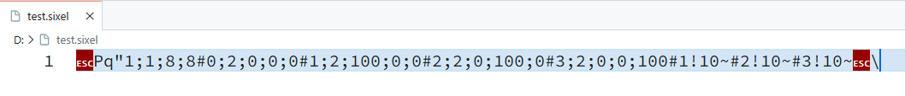
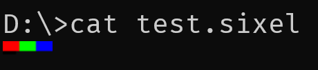
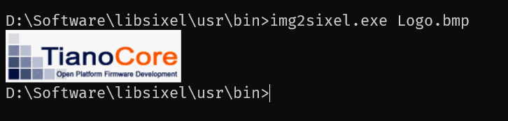

自认识终端以来，对于它的印象似乎总停留在黑色背景上一行行的字符，看起来很 hacker 的样子。
但是，终端能支持的功能其实比印象中要强大的多。例如，显示图像。这需要用到终端图形协议（图形格式），
Sixel 是其中一种，利用它便可以在终端中显示图像。

本文将尝试在 UEFI 环境下使用 Sixel 来探索一些有趣的内容。

### Sixel 是什么？

> Sixel, short for "six pixels", is a bitmap graphics format supported by terminals and printers from DEC. It consists of a pattern six pixels high and one wide (in black and white), resulting in 64 possible patterns. Each possible pattern is assigned an ASCII character, making the sixels easy to transmit on 7-bit serial links.

正如维基百科上所述，它实际上是一种图形格式，最初用于打印机，后来被应用于终端。

终端在接收到特定序列数据 `ESC P q` 后进入 Sixel mode，然后解析之后的图像数据，直到 `ESC \` 恢复为正常的字符模式。

下面是一组简单的数据（十六进制）：

```
1B 50 71 22 31 3B 31 3B 38 3B 38 23 30 3B 32 3B 30 3B 30 3B 30 23 31 3B 32 3B 31 30 30 3B 30 3B 30 23 32 3B 32 3B 30 3B 31 30 30 3B 30 23 33 3B 32 3B 30 3B 30 3B 31 30 30 23 31 21 31 30 7E 23 32 21 31 30 7E 23 33 21 31 30 7E 1B 5C
```

如果在一些编辑器中查看，能更清楚的看到前后的特定序列：



如果在终端中直接 cat 一下，可以看到下面的结果：



### libsixel

[libsixel](https://github.com/saitoha/libsixel) 是一个开源的 Sixel 图形库，它提供了对 Sixel 格式的编码和解码功能。

使用它（img2sixel）我们可以轻松在终端中显示图像。



甚至还可以借助它在终端播放视频（ffmpeg 集成）、浏览网页（W3M 增强）等。

### 在 UEFI 下 encode

libsixel 已经提供了足够的功能，所以只需将其移植到 UEFI 环境下，然后可以提供一个 API 使用 `sixel_encode` 将 `EFI_GRAPHICS_OUTPUT_BLT_PIXEL` 编码为 Sixel 格式数据即可。

具体的移植步骤此处不展开细说，本质上就是提供一些必要的 CRT Wrapper 函数，这也是在仅使用 edk2 主线代码移植其他三方代码时的整体思路。

由于并没有计划/必要提供 decode，所以最终只先提供了一个最简单的 API，其使用方法如下：

```
//
// Blt              - Image pixel(EFI_GRAPHICS_OUTPUT_BLT_PIXEL)
// Width            - Image width
// Height           - Image height
// 0                - NColors, Reserved
// write_fn         - Callback function to write encoded data
// write_fn_private - Private data parameter for write_fn
//
SixelEncodeBytes ((UINT8 *)Blt, Width, Height, 0, write_fn, write_fn_private);
```

其中 `write_fn` 是一个回调函数，用来处理 encode 出来的数据。

### 在哪里用它，怎么用

在包含显卡设备的 UEFI 环境中，可以很容易在 Shell 中显示图片，但如果是没有显卡的环境，似乎就只是文本的世界了。

但是，如果使用支持 Sixel 的终端连接测试机的串口，那么借助 Sixel 我们则有机会来显示图片，下面是一个简单的测试。

```
static
UINTN
EFIAPI
sixel_write_to_port (
  CHAR8 *Data,
  UINTN Size,
  VOID  *Priv
  )
{

  SerialPortWrite((UINT8 *)Data, Size);

  return EFI_SUCCESS;
}

{
  // ...

  Status = gBS->LocateProtocol (&gEdkiiPlatformLogoProtocolGuid, NULL, (VOID **)&PlatformLogo);
  if (!EFI_ERROR (Status)) {
    Status = PlatformLogo->GetImage (
                             PlatformLogo,
                             &Instance,
                             &Image,
                             &Attribute,
                             &OffsetX,
                             &OffsetY
                             );
  }

  Blt = Image.Bitmap;
  SixelEncodeBytes ((UINT8 *)Blt, Image.Width, Image.Height, 0, sixel_write_to_port, NULL);

  for (UINTN Index = 0; Index < Image.Height / EFI_GLYPH_HEIGHT; Index++) {
    Print (L"\n");
  }

  // ...
```

使用 qemu 和 `-nographic` 参数启动 OVMF，在 UEFI Shell 中测试，可以看到能够在串口中显示出 tianocore logo。 



### 还能做些什么

前面 [UEFI BIOS 下的图形库 -- LVGL](https://yangganguefi.github.io/posts/uefi-edk2-lvgl/) 中展示了一些应用，那么如果将上面的代码添加到 `flush_cb` 中，可以得到下面的效果：



但是确定非常明显，速度太慢了，所以只能用来做简单的测试演示。

### 进一步探索

当使用 `-nographic` qemu 参数启动 OVMF 时，可以发现在 BDS 时是无法显示 logo 的。

但是如果将 `BootLogoLib` 稍微改造一下，那么在这个没有显卡的环境里，也能够在 BDS 时显示 logo 了。



但是，很明显这个做法不够“标准/通用”，最完善的做法应该是基于 SixelLib 实现一个 SixelGopDriver 或者集成到 TerminalDxe 中。不过，对于仅显示 logo 的需求，改造 `BootLogoLib` 已足够了。

### 最后，源码

以上涉及的代码均已上传至 [SixelPkg](https://github.com/YangGangUEFI/SixelPkg)，感兴趣的朋友可以去看一看/试一试。
