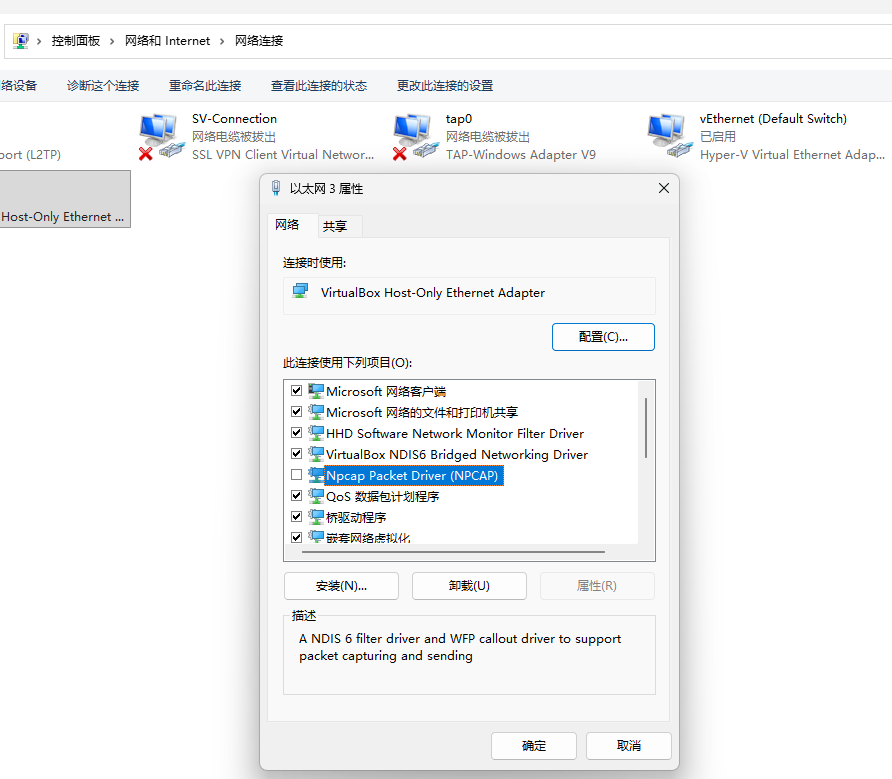
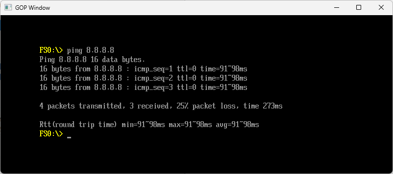
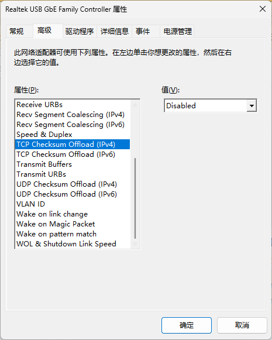

最近在研究 Redfish 相关的内容，所以需要一个环境来做测试。
真实的硬件环境当然是好的选择，但也意味着需要一个能提供支持的 BMC。
不过好在 UEFI 和 Redfish 都有很方便的纯软件模拟环境，更便于在研究过程进行反复尝试。

> The Redfish standard is a suite of specifications that deliver an industry standard protocol providing a RESTful interface for the management of servers, storage, networking, and converged infrastructure.

显然，RESTful 是 Redfish 的特色，用户通过 Redfish 管理时使用的是 RESTful interface。但与 BIOS 相关的内容是需要和 BIOS 进行交互，BIOS 与 Redfish Server 之间交互的实现不同厂商可能会有不同选择。

Edk2 的 NetworkPkg 提供了比较完善网络相关模块，所以 BIOS 也是可以通过 RESTful API 与 Redfish Server 交互的。EDK2 官方的 Redfish Implementation 便是基于 RESTful 的。

本文将分几个部分介绍一下这一切交互的基础，即 Edk2 `EmulatorPkg` 的网络支持。

### EmuSnpDxe

`EmuSnpDxe` 为 `EmulatorPkg` 实现了 `EFI_SIMPLE_NETWORK_PROTOCOL` 支持，它最终会在 `EmulatorPkg\Win\Host\WinPacketFilter.c` 中通过调用 `SnpNt32Io.dll` 中的函数来收发数据包。

### SnpNt32Io.dll 以及如何使用

tianocore 提供了 [edk2-NetNt32Io](https://github.com/tianocore/edk2-NetNt32Io) 源码，下载 [WinPcap® library](https://www.winpcap.org/) 并放入相应的 Src 目录下，编译即可得到 dll。不过本文将提供一个使用 [npcap](https://github.com/nmap/npcap) 构建而来的 dll。

> Npcap is a packet capture and injection library for Windows by the Nmap Project. It is a complete update to the unmaintained WinPcap project with improved speed, reliability, and security.

因为接口是一致的，所以只需简单修改 Makefile 即可使用 npcap 替换 WinPcap。修改后的代码在 [https://github.com/YangGangUEFI/edk2-NetNt32Io](https://github.com/YangGangUEFI/edk2-NetNt32Io)。


```
!IF "$(PCAP)" == "NPCAP"
WINPCAP_DIR = ".\npcap"
!ELSE
WINPCAP_DIR = ".\WpdPack"
!ENDIF
```

然后借助 Github Action 添加一个 build workflow，最终可以在 [releases](https://github.com/YangGangUEFI/edk2-NetNt32Io/releases/tag/2026-01-30) 这里直接下载构建好的 dll（注意，）。

使用也比较简单，按照如下步骤操作即可：

1. 下载 [Npcap installer](https://npcap.com/#download) 并安装
2. 下载 [SnpNt32Io.dll(SnpNt32Io-Dll.zip)](https://github.com/YangGangUEFI/edk2-NetNt32Io/releases/tag/2026-01-30)，将 .dll 放在 WinHost.exe 同目录下
3. 在控制面板->网络和 Internet->网络连接中将非实际使用的物理网卡设备取消勾选 NPCAP 驱动（可选）
   
4. 启动 WinHost.exe，在启动日志中找到如下信息，然后配置 `gEmulatorPkgTokenSpaceGuid.PcdEmuNetworkInterface|L"0"` (0-based 索引，选择你的物理网卡，此处 L"0" 使用的为 xx:xx:xx:xx:xx:xx 设备)，然后重新编译 EmulatorPkg
   ```
   The MAC address of the adapter is xx:xx:xx:xx:xx:xx
   The MAC address of the adapter is yy:yy:yy:yy:yy:yy
   Number of NICs found: 2
   ```
5. 再次启动 WinHost.exe 并进入 UEFI Shell，ifconfig -l 检查 IP，ping 检查连接
   

### 注意事项

如果访问同一网段的地址，可能会遇到如下错误：

```
TcpInput: received a checksum error packet
```

可以在设备管理器->网络适配器->xx:xx:xx:xx:xx:xx对应网卡设备->高级属性中找到 Checksum Offload 属性，然后将值改为 Disabled。暂时规避这个问题。



### 最后

至此，便完成了 RESTful Redfish 模拟验证环境最基础的一步 -- 网络，接下来将在此基础上来做实际的验证。
